# C++11/14 笔记

这篇文章记录了学习侯捷老师C++11/14课程的笔记。C++11是C++2.0，引入了许多新的特性，将从语言层面和标准库层面（以header files形式呈现）来介绍这些新的特性。

[TOC]

## 语言层面
怎样确定C++环境是否支持C++11呢？
使用如下语句：

```c++
cout << __cplusplus << endl;
```

如果出现的头六位数是大于等于201103的，则支持C++11。

### 模板表达式中的空格

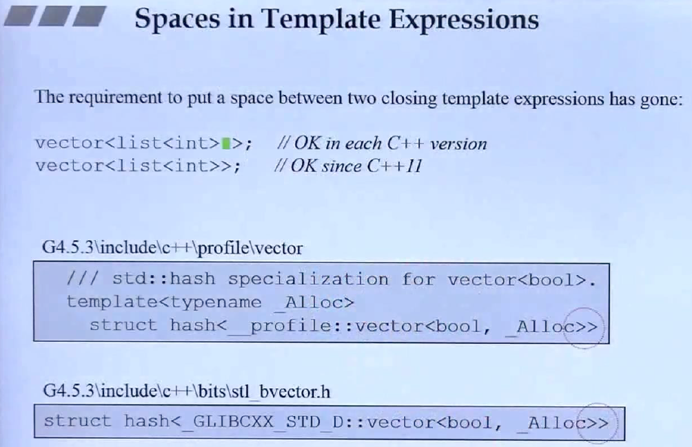

在C++11之前，模板后面的尖括号需要空格，C++11之后就不需要了。

### nullptr和std::nullptr_t


使用nullptr代替NULL和0来代表指针没有指向值。这可以避免把空指针当int而引发错误。上图中给出了函数调用的实例，使用nullptr不会出现这种问题，这是因为nullptr是std::nullptr_t类型，c++11以后，std::nullptr_t也是基础类型了，可以自己定义变量。

### 自动推导类型----auto

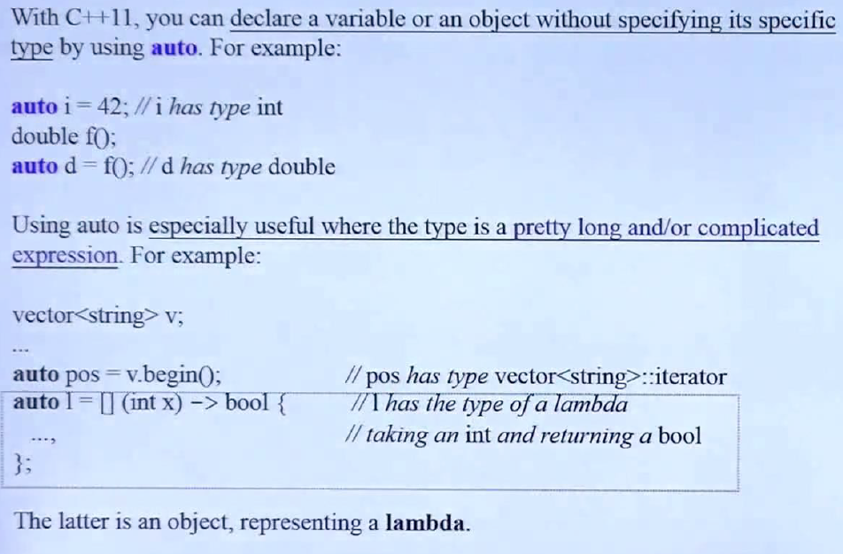

C++11之后，可以使用auto自动推导变量和对象的类型，而不需要自己手写出来，对于有非常复杂而长的类型来说，这是很方便的，另外auto还可以自动推导lambda表达式的类型，然后就可以把lambda函数当普通函数使用。

典型用法（更简单）：

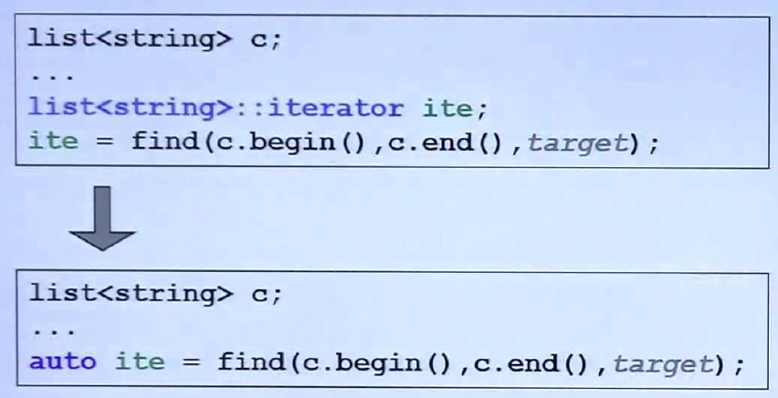

标准库中的使用：

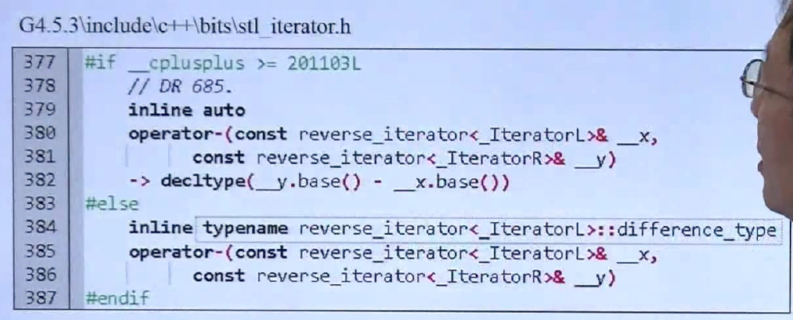

### 一致性初始化----Uniform Initialization

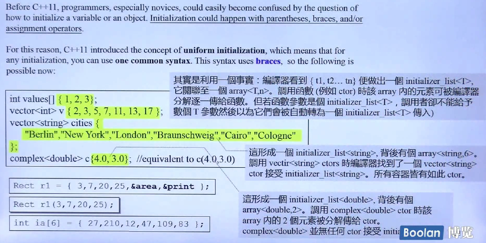

C++11引入了一个通用的初始化方式——一致性初始化，使用大括号括起来进行初始化，编译器看到这种初始化会转换成一个initializer_list<T>，然后要分两种情况：

- 如果对象带有接受initializer_list<T>的构造函数版本，那使用该构造函数进行初始化。（如上vector<string>初始化）
- 如果对象没有initializer_list<T>的构造函数版本，那编译器会将initializer_list<T>逐一分解，传给对应的构造函数。（如上complex初始化）

另外，如果函数的参数就是initializer_list<T>，那么就必须传入initializer_list<T>，而不能传入多个T参数。

### 初始化列表（initializer_list）

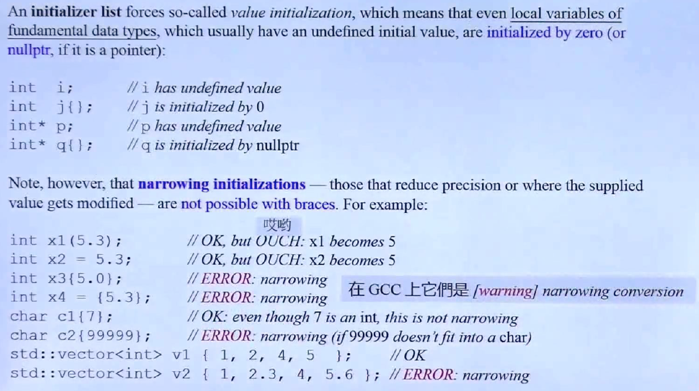

大括号可以设定初值（默认值），另外，大括号初始化不允许窄化转换（书籍上这样说的，实际gcc只会给出警告，但这不是好习惯）。

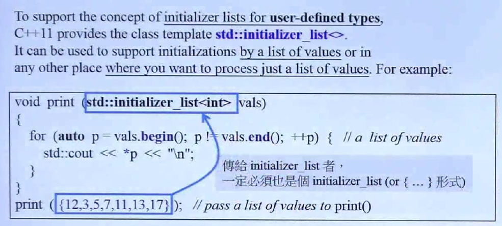

C++11提供了一个std::initializer_list<>, 可以接受任意个数的相同类型，上面是一个实例。

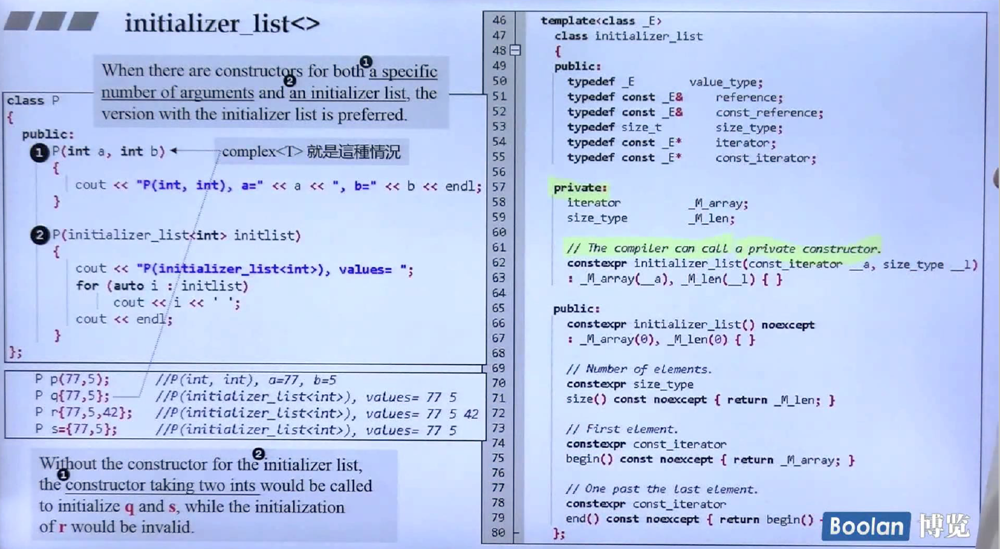

上图的左边是initializer_list在构造函数中的应用，右边是initializer_list的源代码，它的内部有一个array和一个长度，另外initializer_list的构造函数是私有的，但编译器当看到大括号的时候，就会调用这个构造函数，编译器有无上权力。initializer_list构造函数会传入array（C++11新提出的，对数组进行封装，可以使用算法库）的头部迭代器，以及它的长度。

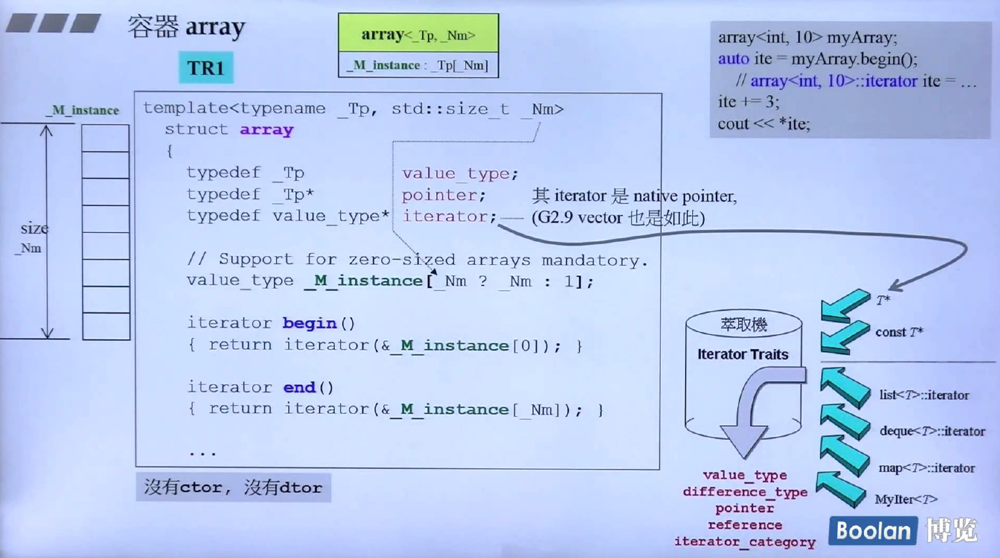

上面是array的源代码，里面就是一个基本的数组，然后封装了begin和end迭代器。

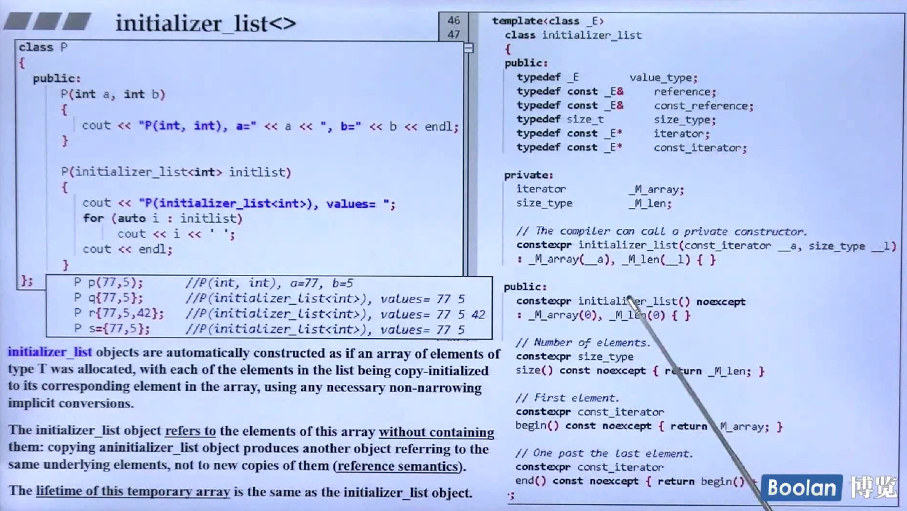

左下角是新东西，其他的之前出现过了，第一句话是指initializer_list背后有一个array在支撑，第二句话是说initializer_list并没有包含那个array，只是有一个指针指向那个array的头部和一个size_t等于array的长度。如果拷贝initializer_list，只是浅拷贝，指向同一个array以及得到同一个长度。最后一句话是说那个临时array的生命周期与initializer_list是相同的。

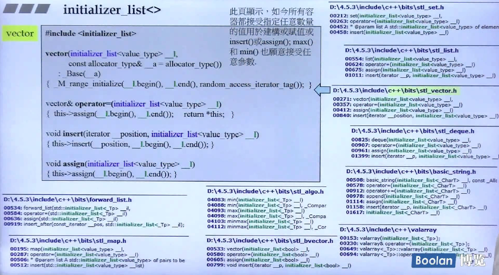

这是标准库中使用initializer_list的各个地方，非常之多，这里只列举vector里面的使用，有初始化，重载赋值运算符，插入以及分配。

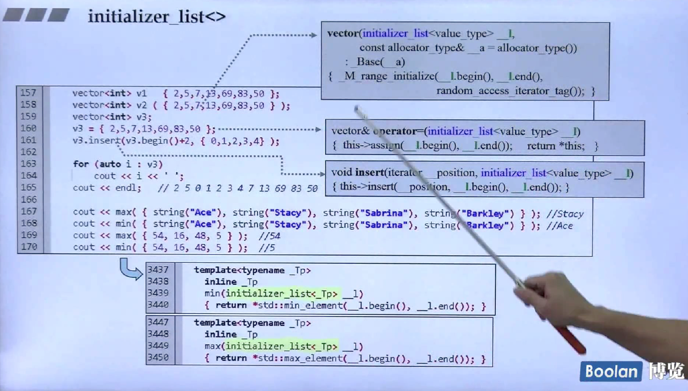

上面的是具体事例以及对应调用有initializr_list的方法。

### explicit

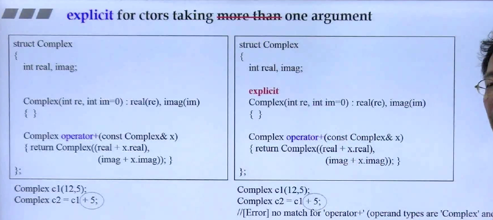

这节在C++面向对象高级编程中有很多的补充，可以去看看，在构造函数前面加上explicit, 就是告诉编译器, 不要在将int类型隐式转成Complex, 只能通过显式地进行构造。

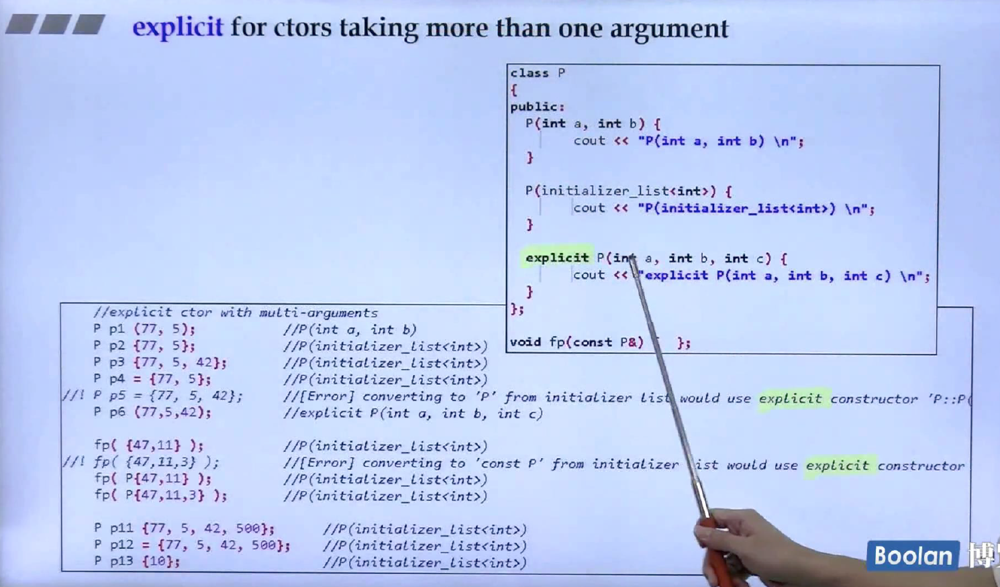

之前一张图是只有一个实参，这里是多个实参的例子，当使用运行p3{77, 5, 42}的时候，直接调用的是带有initializer_list的构造函数（一致性初始化），而p5 = {77, 5, 42},  {77, 5, 42}是initialization_list<int>类型，不能隐式将initialization_list<int>转成各个int，更详细的可以参考https://stackoverflow.com/questions/30142484/explicit-constructor-and-initialization-with-stdinitializer-list/30142573 ，提问一模一样。我自己也进行了测试，发现P p5 = {77, 5, 42}并没有报错，它调用的是initialization_list<int>的构造函数，可能使用的编译器不一样，导致结果也不一样，我使用的是Clion+MinGW。但一样的，如果没有initialization_list<int>的构造函数，就会报错，原因上面说了。

### for each

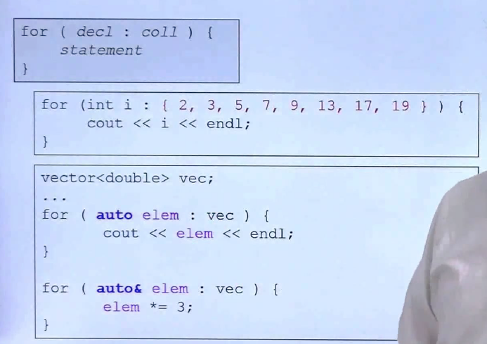

这一小节讲的是非常实用的for，C++11提供了range-based for，如上所述，decl是申明，coll是容器，意思是一个个拿出coll中的元素，下面有实例，可以搭配auto使用，非常方便，需要in-place的话，加上&即可。

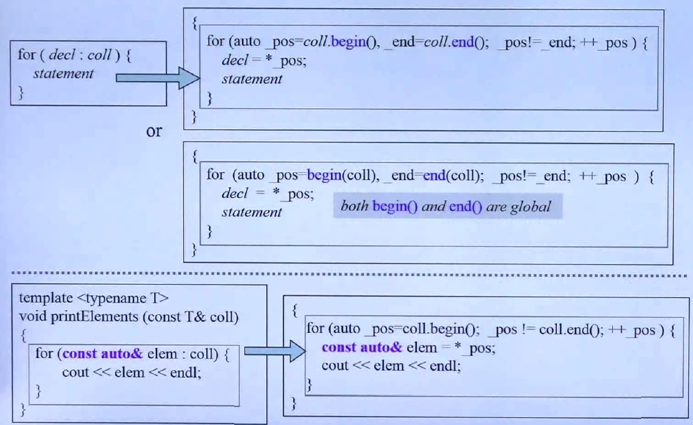

左边是range-based for，右边是编译器对它的解释。

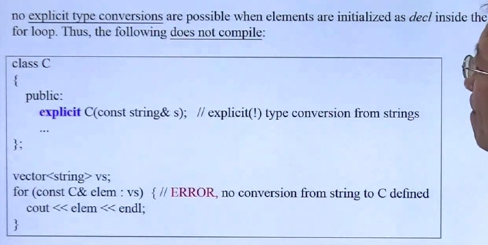

这是explicit的一个例子，禁止编译器隐式将String转化C，所以会报错。

### =default， =delete

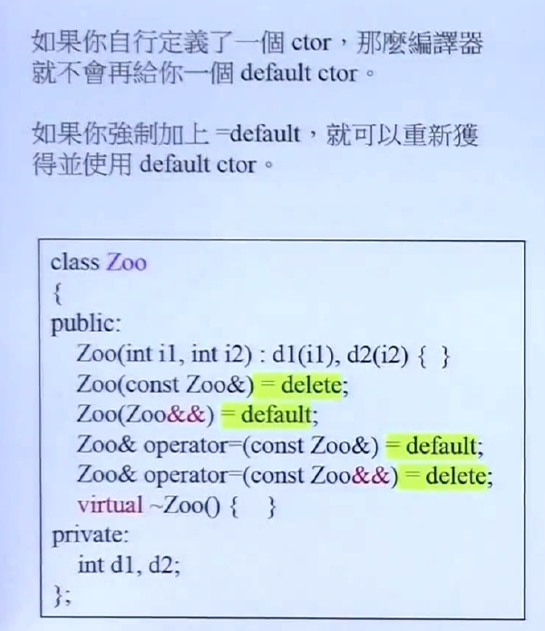

=default要的是编译器给的default ctor，=delete是不要对应的ctor，例如，上述的`Zoo(const Zoo&)=delete`是说不要拷贝构造，`Zoo(const Zoo&&)=default`是说要编译器默认给我的那一个。

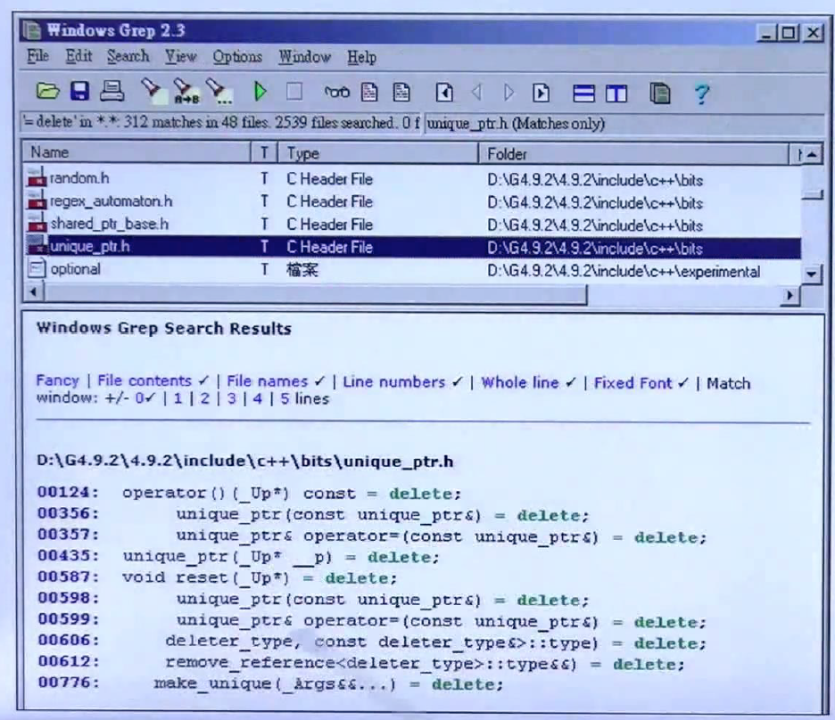

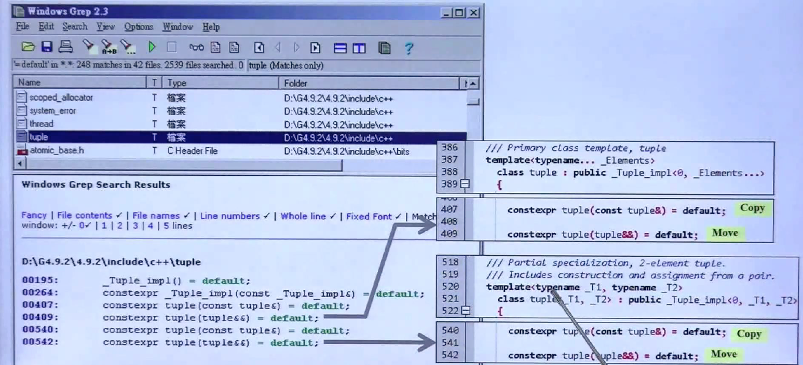

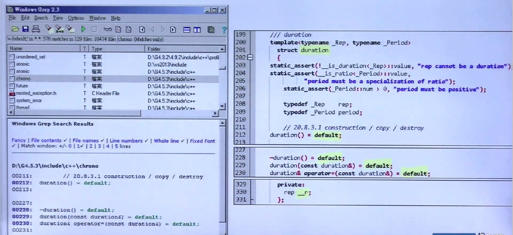

以上三张图是C++标准库中使用=default和=delete的事例，标准库都用了，那自然是好的。（这里注意析构函数不能用=delete，可能会出大问题）

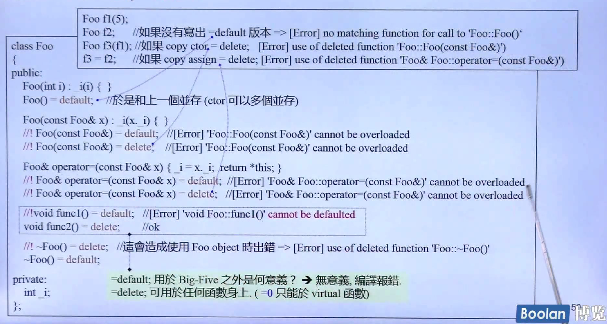

构造函数可以有多个版本，上述定义了两个Foo的构造函数，一个是有实参的，另一个使用=default得到编译器默认给出的构造函数。对于拷贝构造而言，只能允许一个，所以当使用=default的时候，由于已经写出一个了，就无法进行重载了，而使用=delete的时候，由于写出来了，无法进行删除了。拷贝赋值情况类似。对于一般函数来说，没有default版本，所以对一般函数进行=default是不对的，但=delete可以有，但没必要，写出来不要还不如不写。上图中还给出了=default，=delete与=0的区别，区别在与=default只能用于big-five(构造函数，拷贝构造，赋值构造，析构，移动构造，移动赋值)， =delete可以用于任何函数，但有时没有必要使用，如上面所说，而=0只能用于虚函数，代表纯虚函数。

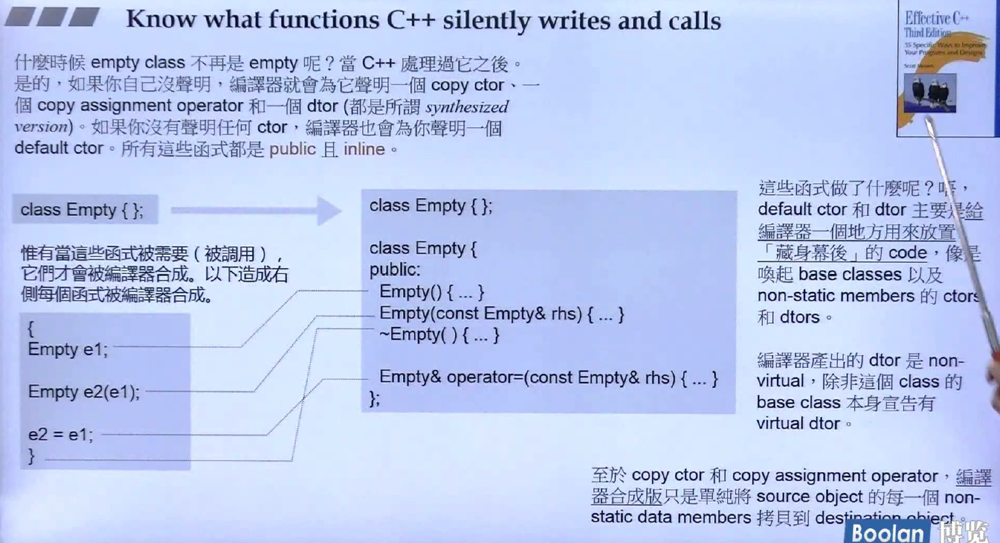

对于一个空的class，C++会在空的class内部插入一些代码（默认的构造函数，拷贝构造，拷贝赋值以及析构函数，都是public并且是inline的），这样才会使左下角的的代码运行正常，作用还不止这些，这些默认的函数还给编译器放置藏身幕后的一些代码，比如当涉及继承的时候，调用base classes的构造和析构就会对应放置在默认生成的构造和析构当中。

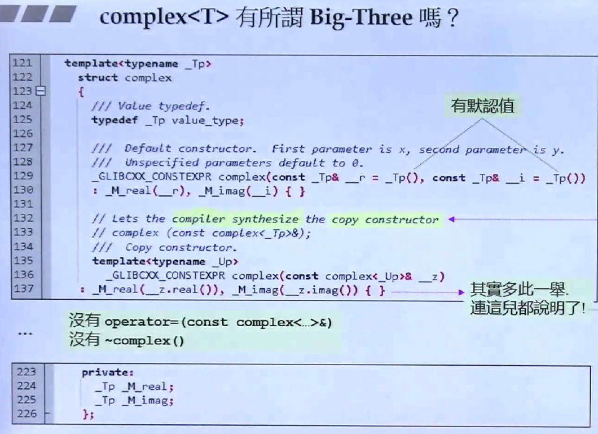

如果一个类带有pointer member，则需要自己定义big-three，而没有pointer member的话，用编译器默认提供的就足够了。上面的complex就是直接使用编译器默认提供的拷贝赋值和析构。更详细的推荐看我写的面向对象程序设计_part1部分的笔记，有非常详细的讲述。

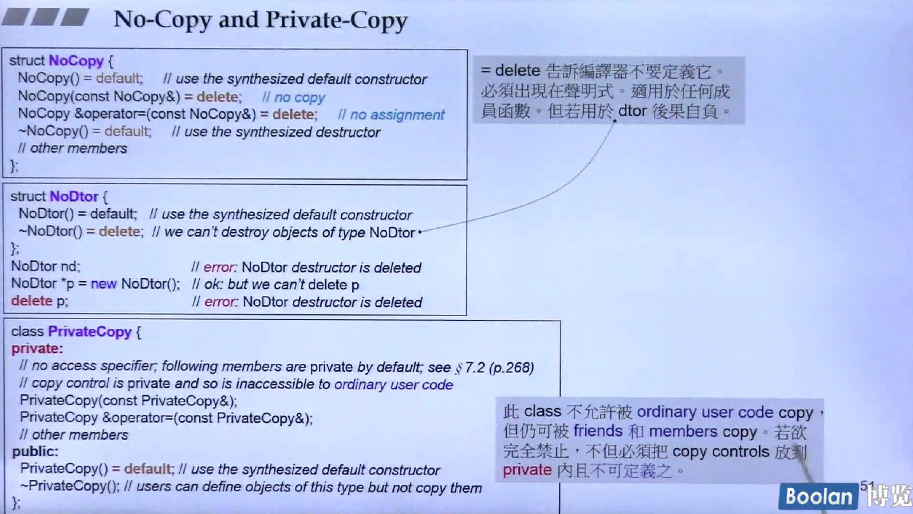

上图是=default和=delete的使用事例，class NoCopy把拷贝构造和拷贝赋值都=delete，也就是没有这两个了，不允许外界去拷贝这个类的对象，这个在一些事例上是有用的。class NoDtor则不要析构函数了，对象创建无法删除，会报错。（一般不会这么使用）最后的PrivateCopy把拷贝构造和拷贝赋值放入了private里面，这限制了访问这两个函数的使用者，一般用户代码无法调用，但友元以及成员可以进行拷贝。

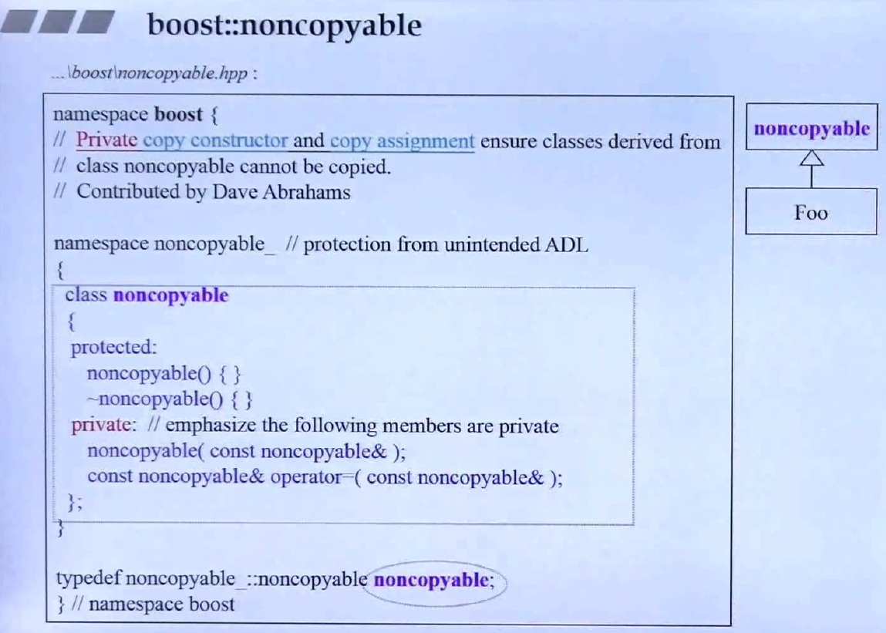

这是一个Boost库的例子，与上述的PrivateCopy一样，它的作用是让其他类继承这个类，这样其他类也拥有noncopyable同样的性质。

### Alias Template 与 Template Template parameter

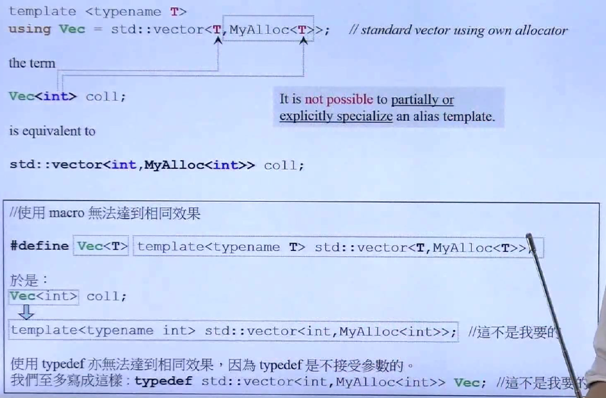

C++11引入了Alias Template，用法如上所示，先些template <typename T> , 然后使用using命令设定别名模板，这样些可以自己设定类型以及容器的分配器。而使用define和typedef确不能达到效果。但别名模板有一个限制，不能进行偏特化（可以参考面向对象的笔记了解什么是偏特化）

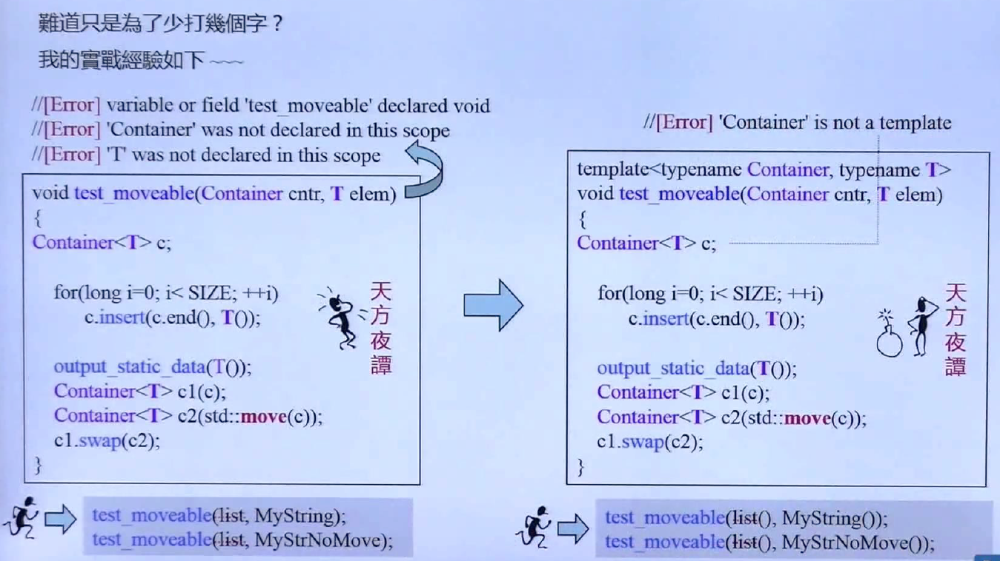

Alias template难道只是少打几个字吗? 不是的，上图进行说明，函数test_moveable测试不同容器的move操作（右值引用）和拷贝操作的时间比较，想使用容器和元素的类型，这是天方夜谈的，container和T是不能再函数内部使用，报出了三个错误。然后再进行改进，改成右边形式的，利用函数模板的实参推导可以推出Container和T的类型，不然依然是天方夜谭，编译器不认识Container是个模板，无法使用尖括号<T>.

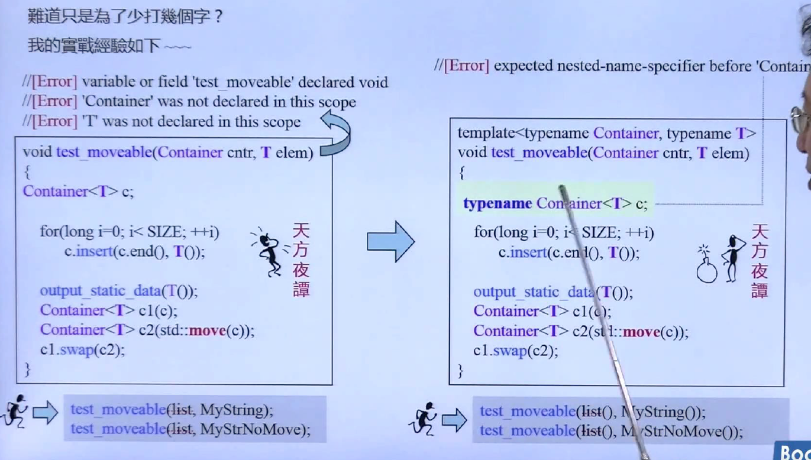

这一页在Container前面加上了typename，告诉编译器Container<T>就是一个typename，然而编译器还是报错，认为期望嵌套名称说明符在Container前面，还是无法识别模板。

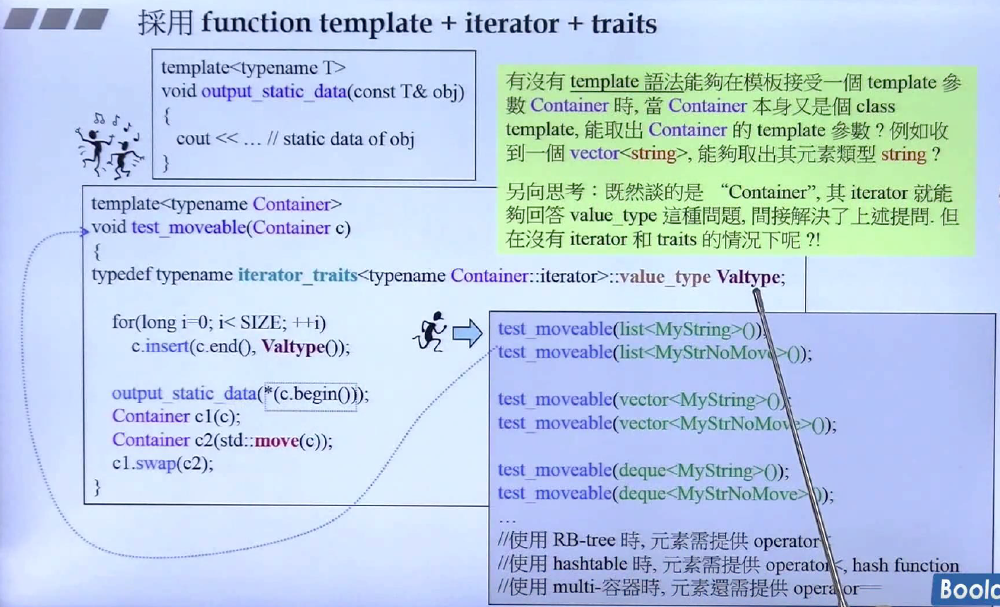

上图就是解决方案，传入的实参只有一个，根据模板函数的自动推导，得到它的迭代器（前面要加typename），然后通过一个迭代器萃取机引出对象的Value_type, 然后根据typedef得到值类型，这样就不会报错了。然后看右上角黄色的话语，如果没有iterator和traits，该怎么解决这一问题呢？上面就是思考路径，在模板接受模板，能不能从中取出模板的参数？

这就需要template template parameter了。

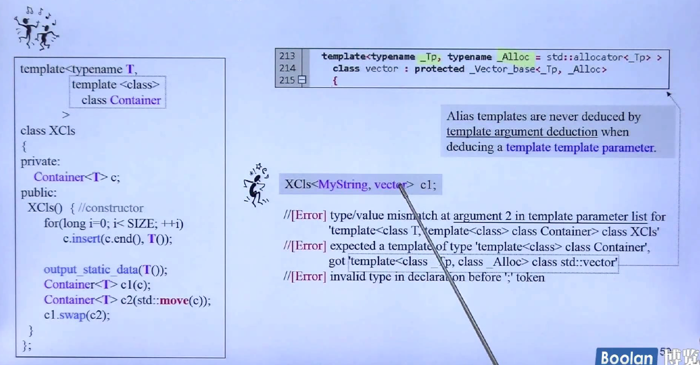

模板模板参数是模板嵌套模板，如上面所示，XCI接受两个参数，第一个是T，第二个是模板Container，然后就可以直接使用`Container<T> c;` 因为Container是一个模板，但再调用`XCIs<Mystring, vector> c1;`的时候，出现报错，原因是vector有两个模板参数，第二个模板参数（分配器）是默认的，但编译器不知道，这个时候就需要用到Alias Template了。

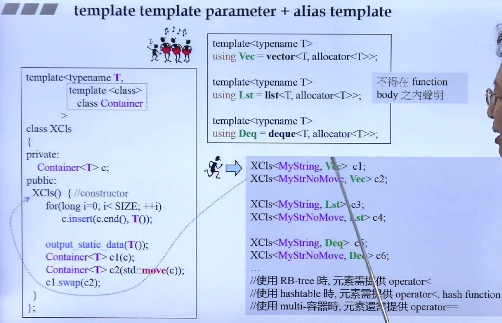

使用Alias Template，就可以将Vec变为一个模板参数的模板，然后就可以初始化对象了。可以看到Alias Template不仅是少打几个字，还有减少模板参数个数以适配模板模板参数，非常有用处。

### Type Alias

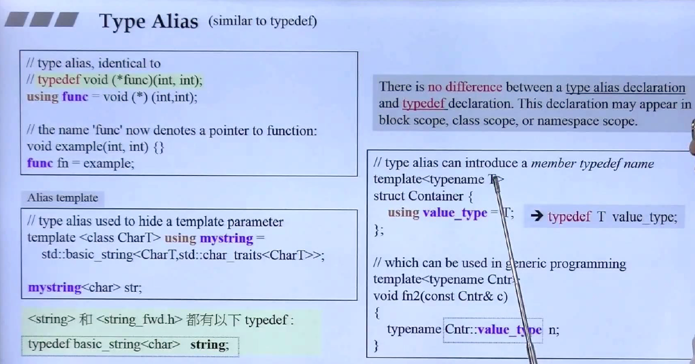

Type Alias是另一个typedef的写法，不过更加清晰，通过using关键字去实现，左上角的是定义了一个函数指针，用typedef不太明显，用using很清晰，另外还可以用于类中成员，右下角所示。左下角是Alias Template的例子，我们日常使用的string实则是basic_string<char>, 左下角给出了using和typedef的写法，右上角说明两者是没有任何差别的。

### using

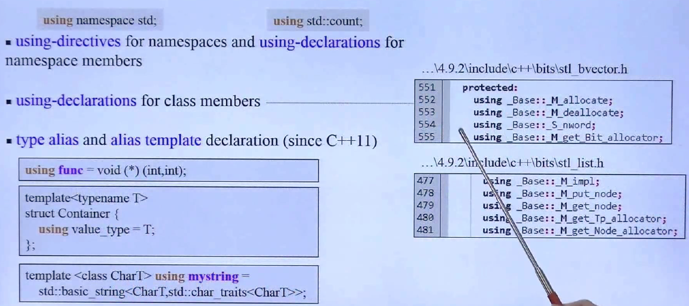

给出了using的使用场景。

### noexcept

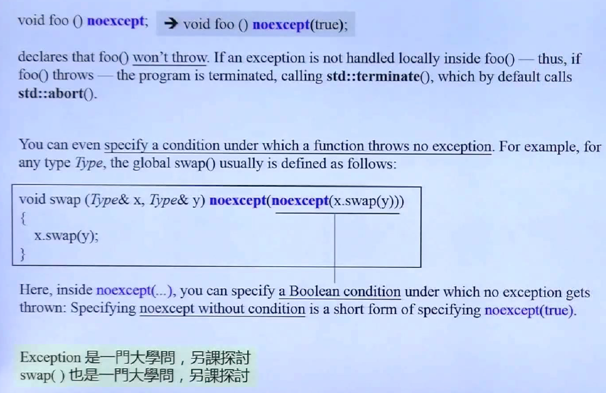

noexcept是放在函数右括号后，宣称这个函数不会抛出异常（这里还给出异常的回传机制，调用foo如果抛出异常，foo会接着往上层抛出异常，如果最上层没有处理，则会调用terminate函数，terminate函数内部调用abort，使程序退出），noexcept可以接受条件，如上所示，没有加条件，默认是不会抛出异常，swap函数不发生异常的条件是noexcept(x.swap(y))不会发生异常。

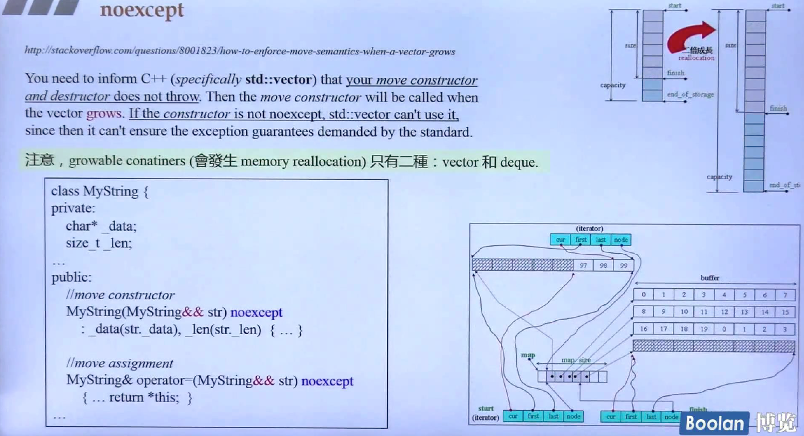

在使用vector和deque的移动构造和移动赋值的时候，如果移动构造和移动赋值没有加上noexcept，则容器增长的时候不会调用move constructor，效率就会偏低（逐一拷贝），所以后面需要加上noexcept，安心使用。

### override

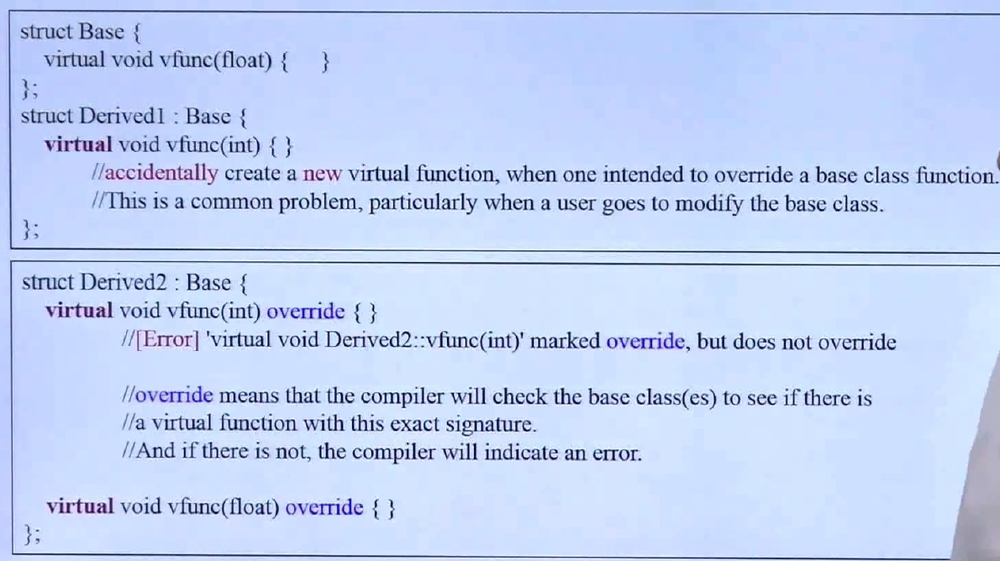

override用于虚函数，上面的virtual void vfunc(int)实际上不是重写父类的虚函数，而是定义一个新的虚函数，我们的本意是重写虚函数，但这样写编译器不会报错，确实没问题，那如果像下面加上override的话，则会报错，因为已经告诉了编译器，我确实要重写，但写错了，没有重写，于是就报错了。

### final

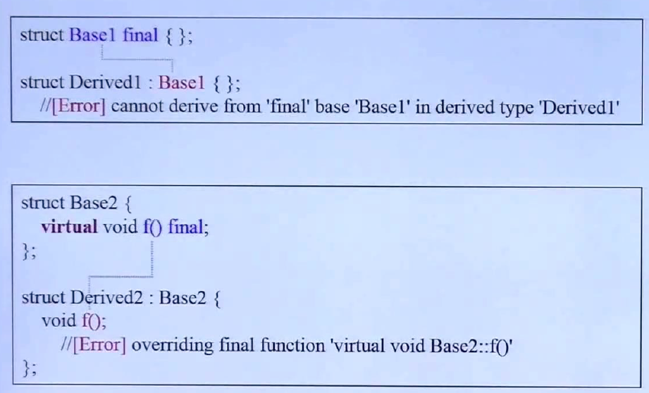

final关键字用于两个地方，第一个用在类，用于说明该类是继承体系下最后的一个类，不要其他类继承我，当继承时就会报错。第二个用在虚函数，表示这个虚函数不能再被override了，再override就会报错。

### decltype

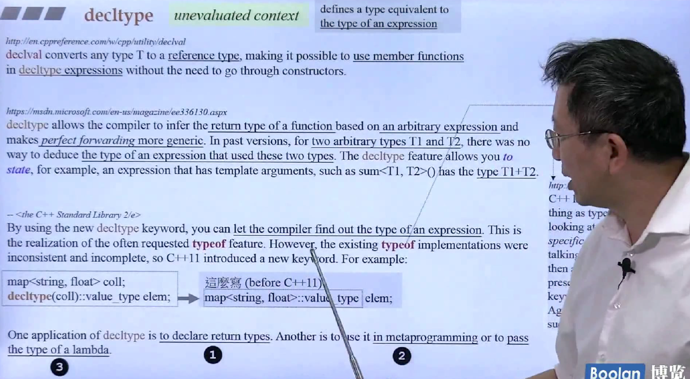

使用decltype关键字，可以让编译器找到一个表达式它的类型，这个很像typeof的功能，然而已存在的typeof的实现并无完整和一致，所以C++11介绍了一个新的关键字，上面给出了一个事例（coll可能离elem很远）。

decltype的应用有三部分，用作返回值的类型，元编程以及lambda函数的类型

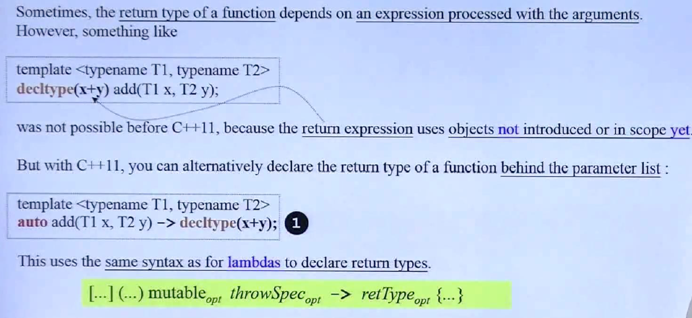

上图就是用作返回值的类型，图中第一个代码块编译无法通过，因为return表达式所用的对象没有在定义域内。C++11则允许另外一种写法，第二个代码块，返回类型用auto暂定，但在后面写出，用`-> decltype(x+y)`, 这里要说明，模板是一种半成品，类型没有定义，`decltype(x+y)`也能是正确的也可能是错误的，取决于调用者本身的使用。`-> decltype(x+y)`与lambda的返回类似。

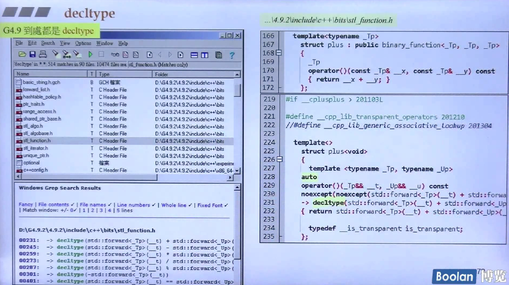

上图是decltype在标准库中的使用，到处可见。

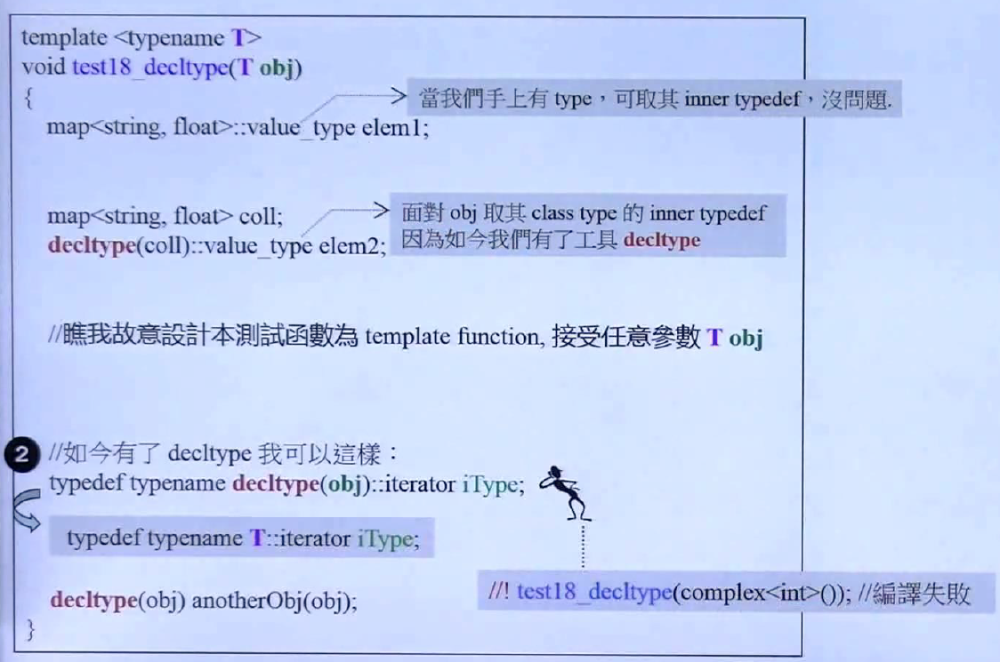

用于元编程推导实参的类型，由于加了`::iterator`, 传入的实参必须是容器，传入复数会报错，这就是模板的半成品特性。

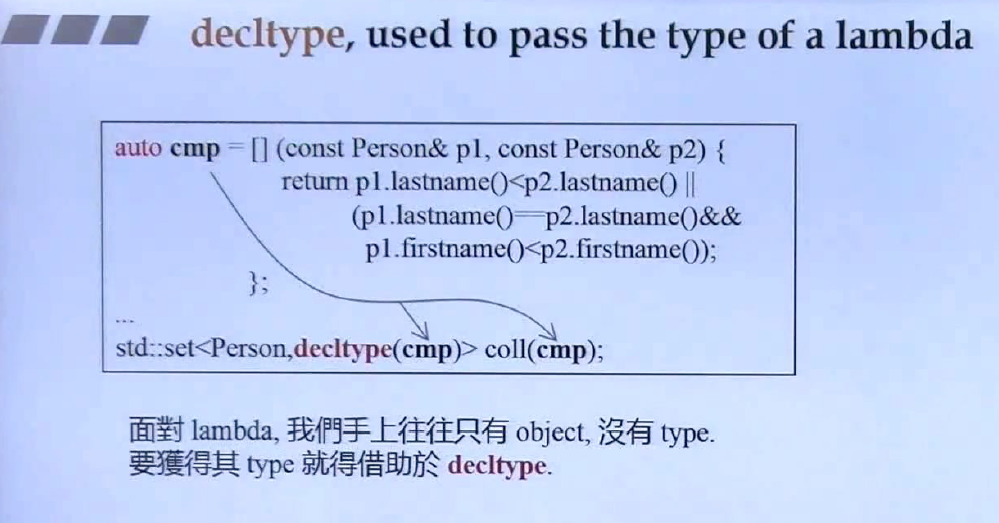

对于lambda函数，很少有人能够写出它的类型，而有时就需要知道它的类型，如上定义所示，这时候就可以使用decltype来自动推导lambda函数的类型。

### lambdas

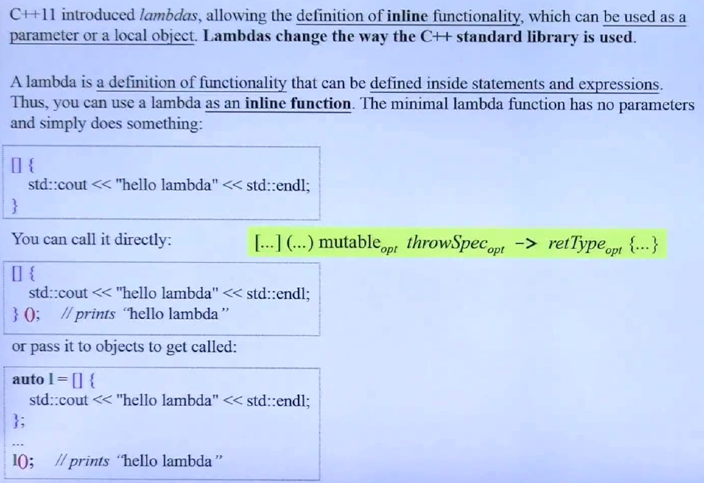

C++11介绍了lambdas（可以说是匿名函数或仿函数），允许定义在声明和表达式中，作为一种内联函数。如上所示，最简单的lambda通过一个[]{statements}表示，可以直接加()运行，或者使用auto l = []{statements}，l则代表lambda函数，可以在后面进行调用。


上面是lambdas函数的结构类型，中括号[]内部是可以抓取外面的非静态对象进行函数内部的使用，有以值[=]进行抓取和以引用[&]进行抓取，如果只抓取部分对象，可以进行指定，如上面的x，y，x就是按值进行抓取，y就是按引用进行抓取。小括号()里面则是可以接函数参数，跟普通函数一样。`mutable`可选，指的是以值进行抓取的对象是否可变，可变就需要加上，否则会报错。`throwSepc`是指这个函数可以不可以抛出异常。`->retType`指的是lambda函数的返回类型。大括号内部则是函数的主体。

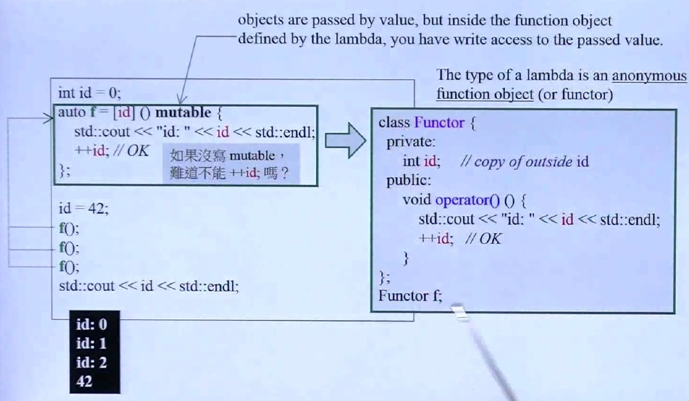

上面是一个事例，这页幻灯片说的是lambda函数映射类似一个仿函数和mutable的作用，之所以说类似，这是因为如果lambda以值传递，则要修改值对象，需要加上mutable，否则会报错，而仿函数没有限制。

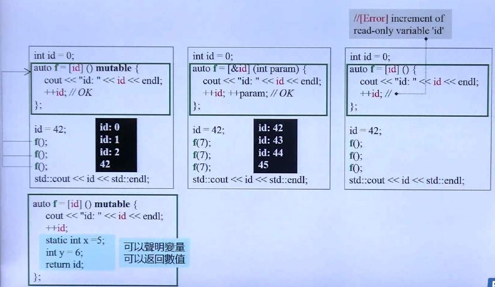

这页幻灯片是上页的比较，要修改以值传递的对象，需要加mutable，如果是按引用传递的对象，则可以不加，如果修改以值传递的对象而不加mutable，则会报错read-only. 此外，以引用传递的对象，不仅会受lambda函数内部的影响，还会受到外部的影响。另外，在lambda函数中，可以申明变量和返回数值。

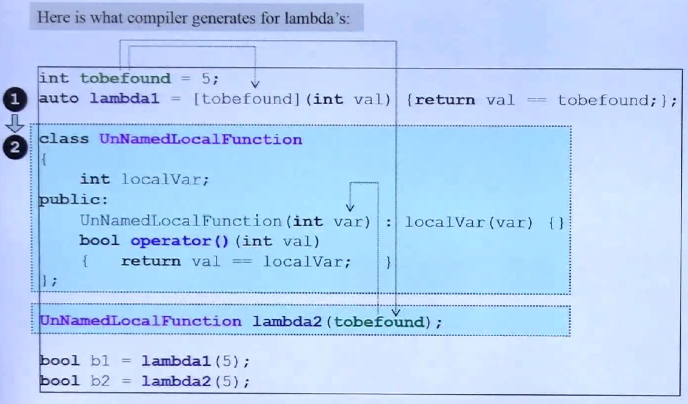

上图是编译器给lambda函数生成得代码，可以看到就是一个仿函数（重载了小括号操作符）的类，用lambda形式写非常简洁，并且要高效一些（inline）。


这张图的最上面是说每一个lambda函数都是独特的，要申明lambda对象的类型，可以使用template或者auto进行自动推导。如果需要知道类型，可以使用decltype，比如，让lambda函数作为关联容器或者无序容器的排序函数或者哈希函数。上面代码给出了事例（decltype的第三种用法中的事例），定义了一个lambda函数用cmp表示，用来比较Person对象的大小，传入到Set容器中去，但根据右边的set容器的定义，我们传入的不仅是cmp（构造函数），还要传入模板的cmp类型（Set内部需要声明cmp类型），所以必须使用decltype来推导出类型。（如果没有向构造函数传入cmp，调用的是默认的构造函数，也就是`set() : t(Compare())`, 这里会报错, 因为Compare()指的是调用默认的lambda构造函数，而lambda函数没有默认构造函数和赋值函数）

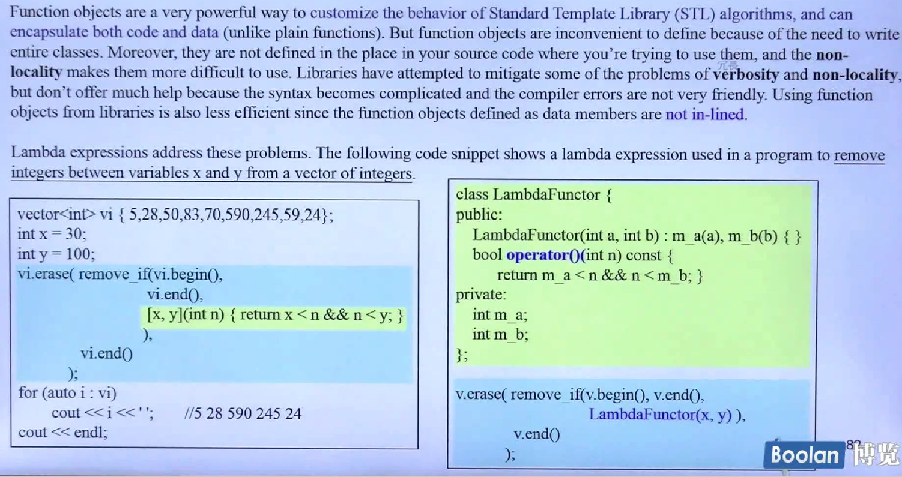

函数对象是很强大的，封装代码和数据来自定义标准库的行为，但需要写出函数对象需要写出整个class，这是不方便的，而且是非本地的，用起来也麻烦，需要去看怎样使用，另外编译出错的信息也不友好，而且它们不是inline的，效率会低一些（算法效率还是最重要的）。而lambda函数的提出解决了这个问题，简短有效清晰，上面的事例很好的说明了这个问题，用lambda要简短许多，功能一样，很直观。

### Variadic Template （重磅原子弹）

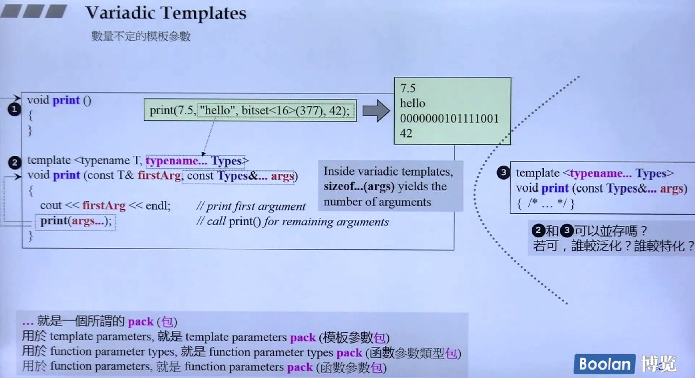

Variadic Template是指数量不定，类型不定的模板，这是C++11原子弹级别的炸弹，如上所示的print函数，可以看到接受了不同类型的参数，调用的函数就是拥有Variadic Template的函数，`print(7.5, "hello", bitset<16>(377), 42)`运行的时候，首先会7.5作为firstArg，剩余部分就是一包，然后在函数内部，继续递归调用print函数，然后把"hello"作为firstArg, 其余的作为一包，一直递归直到一包中没有数据，调用边界条件的print（空函数）结束。函数的`...`表示一个包，可以看到，用在三个地方，第一个地方是模板参数加了`...` ，这代表模板参数包，可以指代不同数量不同类型的模板参数，第二个就是函数参数类型包（`Type&...`), 指代不同类型的参数，最后就是函数参数包——不同类型不同数量的参数。

