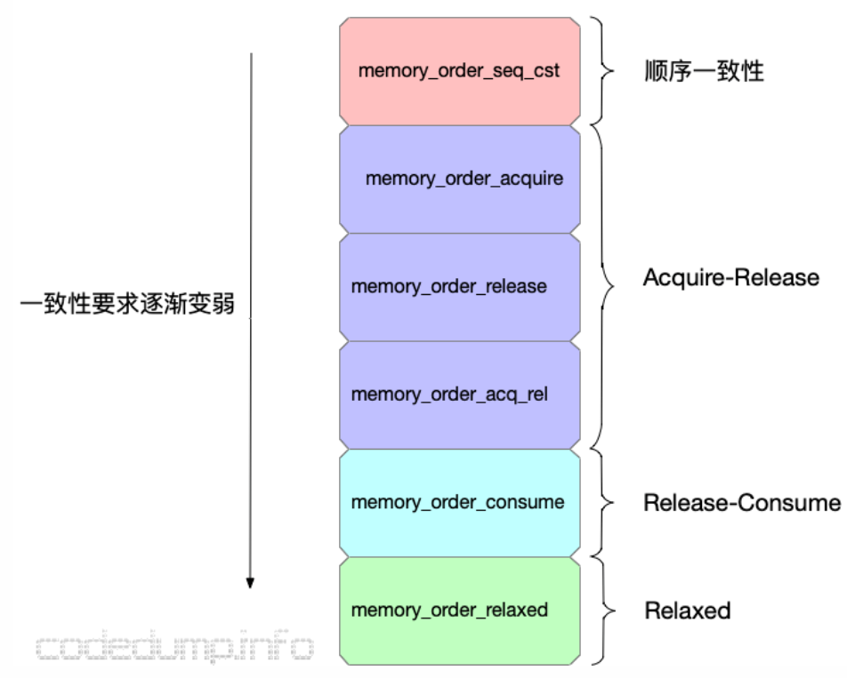
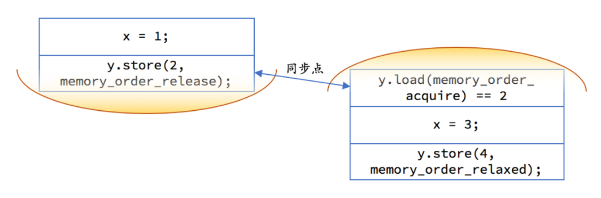

# C++11内存模型

最近看了极客时间——《现代C++实战三十讲》中的内存模型与Atomic一节，感觉对C++的内存模型理解还不是很清楚，看了后面的参考文献以及看了一些好的博客，算是基本了解了，根据参考文献整合一下。更多细节可以看看参考文献。

## 内存模型解决的问题

### 并发的不确定性

多个线程操作共享的变量，由于操作不是原子性的，很有可能会导致结果未定义。

```c++
          int64_t i = 0;     // global variable
Thread-1:              Thread-2:
i = 100;               std::cout << i;
```

对于上面的程序，线程1对一个int64类型的变量进行写操作，需要两个CPU指令，所以线程2可能会读到只执行1个CPU指令的中间状态，导致线程2输出未定义的变量。

### 乱序执行

```c++
Thread-1:              Thread-2:
x = 1;                 if (y == 2) {
y = 2;				       x = 3;
                           y = 4;
                       }
```

对于上面的程序，x和y最后的结果可能会是1和4，这是因为编译器会根据上下文调整代码的执行顺序，使其最有利于处理器的架构，运行得更快。线程1中有可能先执行y的赋值，然后再执行x的赋值，执行到y的赋值，切换到线程2运行结束，再切换至线程1，就会导致1和4的结果。

当然最著名的乱序执行还是属于单例模式的double-check了。

### 缓存一致性

指令乱序执行一节中的示例输出1和4其实还可能跟缓存一致性有关，现代处理器是多核的，每个核都有自己的缓存，对于y可能会先于x写入到内存当中，然后线程2执行结束，写入到内存，最后线程1的x再从缓存写入到内存。

更直观的是下面这个示例，线程1对x进行写操作，但可能还没来得及写入内存，线程2从内存中读入x打印，这也是缓存不一致所引起的。

```c++
          int x = 0;     // global variable
		  
Thread-1:                      Thread-2:
x = 100;    // A               std::cout << x;    // B
```

## C++11的内存模型

从上面的示例看出，多线程不约束会出很多问题，这里的解决方案是std::atomic。

C++11的内存模型共有6种，分四类。其中一致性的减弱会伴随着性能的增强。



### Sequential Consistency

atomic默认的模型是顺序一致性的，这种模型对程序的执行结果有两个要求：

- 每个处理器的执行顺序和代码中的顺序一样。
- 所有处理器都只能看到一个单一的操作执行顺序。

这意味着将程序看做是一个简单的序列。如果对于一个原子变量的操作都是顺序一致的，那么多线程程序的行为就像是这些操作都以一种特定顺序被单线程程序执行。以单线程顺序执行的缺点就是效率低。

### Acquire-Release

原子操作有三类：

- 读：在读取的过程中，读取位置的内容不会发生任何变动。

- 写：在写入的过程中，其他执行线程不会看到部分写入的结果。

- 读‐修改‐写：读取内存、修改数值、然后写回内存，整个操作的过程中间不会有其他写入操作插入，其他执行线程不会看到部分写入的结果。

还是上面的例子，这次把y改成atomic<int>, Store（写操作）使用memory_order_release，条件判断的Load（读操作）使用memory_order_acquire。

```
Thread-1:                            Thread-2:
x = 1;                               if (y.load(memory_order_acquire) == 2) {
y.store(2, memory_order_release);		 x = 3;
                                         y.store(4, memory_order_relaxed); //先不管
                                     }
```

通过这样做，就可以得到我们想要的结果了。用下图示意一下，每一边的代码都不允许重排越过黄色区域，且如果 y 上的释放早于 y 上的获取的话，释放前对内存的修改都在另一个线程的获取操作后可见：



下面是获得和释放操作具体的作用：

- memory_order_acquire：**获得操作**，在读取某原子对象时，当前线程的任何**后面的读写操作**都不允许重排到这个操作的**前面**去，并且其他线程在对同一个原子对象释放**之前的所有内存写入**都在**当前线程可见**。
- memory_order_release：**释放操作**，在写入某原子对象时，当前线程的任何**前面的读写操作**都不允许重排到这个操作的**后面**去，并且当前线程的所有内存**写入**都在对同一个原子对象进行获取的**其他线程可见**。

还有一种读‐修改‐写操作，使用memory_order_acq_rel，含义如下：

- memory_order_acq_rel：**获得释放操作**，一个**读‐修改‐写操作同时具有获得语义和释放语义**，即它**前后的任何读写操作都不允许重排**，并且其他线程在对同一个原子对象释放之前的所有内存写入都在当前线程可见，当前线程的所有内存写入都在对同一个原子对象进行获取的其他线程可见.

### Relaxed

在这种模型下，load()和store()都要带上memory_order_relaxed参数。Relaxed ordering 仅仅保证load()和store()是原子操作，除此之外，不提供任何跨线程的同步，乱序执行依然有。上面Acquire-Release的示例进入条件后，由于不再需要同步了，对循环内部进行重排序不会影响结果，性能还高。

### Release-Consume

- Acquire-Release能保证不同线程之间的Synchronizes-With关系，这同时也约束到同一个线程中前后语句的执行顺序。
- 而Release-Consume只约束有明确的carry-a-dependency关系的语句的执行顺序，同一个线程中的其他语句的执行先后顺序并不受这个内存模型的影响。

该模型目前不鼓励使用，有兴趣可以看下面的参考链接。


## 参考链接

【1】[C++11中的内存模型上篇 - 内存模型基础](https://www.codedump.info/post/20191214-cxx11-memory-model-1/#sequential-consistency-顺序一致性)

【2】[C++11中的内存模型下篇 - C++11支持的几种内存模型](https://www.codedump.info/post/20191214-cxx11-memory-model-2/#release-consume)

【3】[理解 C++ 的 Memory Order](http://senlinzhan.github.io/2017/12/04/cpp-memory-order/)

【4】[如何理解 C++11 的六种 memory order](https://www.zhihu.com/question/24301047)

【5】《现代C++实战三十讲》中的内存模型与Atomic