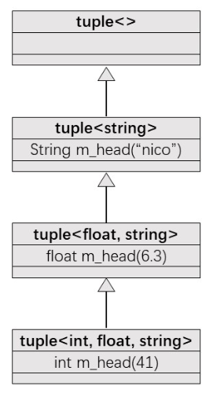
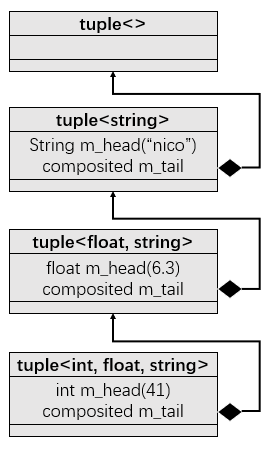

# 使用现代C++实现多种print

[TOC]

学习C++的朋友会遇到这样的问题，有char，int，double等对象，我们想把它们打印出来看看，初学者会通过cout或者传统C语言的printf函数来打印这些对象。

例如：

```c++
int i = 1;
char c = 'f';
double d = 3.14;

//cout
cout << i << endl;
cout << c << endl;
cout << d << endl;

//printf
printf("%d\n%c\n%f", i, c, d);
```

传统C中的printf 函数，虽然也能达成不定个数的形参的调用，但其并非类别安全，写输出格式也不方便，而且支持的是基础类型。使用cout缺点在于代码量会比较多，不好看。所以，能不能很简单地打印出每一个元素呢？

## Print Version1

幸运的是，有更好的解决方案，那就是使用C++11引入的variadic template，先来看看第一个版本的print，并介绍variadic template，代码如下：

```
#include <iostream>
#include <bitset>

using namespace std;

// version1
void print1() {};

template <typename T, typename... Types>
void print1(const T& firstArg, const Types&... args)
{
    cout << firstArg << endl;
    print1(args...);
}

int main()
{
    print1(7.5, "hello", bitset<16>(377), 42);
    return 0;
}
```

运行结果：

```c++
7.5
hello
0000000101111001
42
```

Variadic Template： 是指数量不定，类型不定的模板，如上所示的print函数，可以看到接受了不同类型的参数，调用的函数就是拥有Variadic Template的函数，`print(7.5, "hello", bitset<16>(377), 42)`运行的时候，首先会7.5作为firstArg，剩余部分就是一包，然后在函数内部，继续递归调用print函数，然后把"hello"作为firstArg, 其余的作为一包，一直递归直到一包中没有数据，调用边界条件的print（空函数）结束。

函数的`...`表示一个包，可以看到，用在三个地方，

- 第一个地方是模板参数`typename...` ，这代表模板参数包。

- 第二个就是函数参数类型包（`Type&...`), 指代函数参数类型包。

- 第三个就是函数参数包`args...`，指的是函数参数包。

  另外，还可以使用`sizeof...(args)`得到包的长度。

总的来说，上面是一种递归解决方案，依次展开参数包，然后进行操作。

## Print Version2

你可能觉得上述边界条件的print函数有些多余，比version1更简洁的就是下面的version2：

```c++
template < typename T , typename ... Types>
void print2 (const T& firstArg , const Types&... args)
{
    cout << firstArg << endl;
    if constexpr ( sizeof ...(args) > 0) print2 (args...) ;
}
```

上述函数能够实现version1一样的功能，通过判断args的长度来选择是否结束递归，constexpr可以确保在编译期间去创建空的print边界条件以及print函数。

## Print Version3

除了递归，还有一种通过逗号表达式和初始化列表的方式来解开参数包。

```c++
template < typename T , typename ... Types>
void print3 (const T& firstArg , const Types&... args)
{
    cout << firstArg << endl ;
    initializer_list <T> { ( [&args] {cout << args << endl;}(), firstArg )...};
}
```

其中的`[&args] {cout << args << endl;}()`是构建了一个lambda表达式，并直接运行，没有`]`和`{`之间省略了`()`，所谓逗号表达式展开是指`initializer_list`会将`( [&args] {cout << args << endl;}(), firstArg )...`展开为`([&args1] {cout << args1 << endl;}()， firstArg)`，.... ，`([&argsN] {cout << argsN << endl;}()， firstArg)`，内部的lambda表达式只会生成临时对象，所以最后的`initializer_list`变为了N个firstArg，也就是类型为T，所以`initializer_list`后面才会接上`<T>`。当然也可以将initializer_list打印出来看看:

```c++
template < typename T , typename ... Types>
void prin3_test (const T& firstArg , const Types&... args)
{
    cout << firstArg << endl ;
    auto i_l = initializer_list <T> { ( [&args] {cout << args << endl;}(), firstArg )...};
    for (auto i : i_l)
        cout << i << endl;
}
```

另外, 逗号表达式可以接上多个,不限于一个:

```c++
initializer_list <T> {
            ( [&args] {cout << args << endl;}(), [&args] {cout << args << endl;}(), firstArg)...};
```

## Print Version4

知道上面的initializer_list的解包方式, 还可以只使用一行实现print:

```c++
template <typename ... Types>
void print4 (const Types&... args)
{
    initializer_list <int> { ([&args] {cout << args << endl;}(), 0)...};
}
```

关键在于直接传递参数包 , 第一个参数不需要分开 , 如此就可以达到一行实现print的功能.

## 容器的Print

上述的print只能针对那些基础类型以及重构了`<<`操作符的自定义对象, 对于STL中的容器, 则需要自己重载操作符, 下面给出vector的重载操作符函数(当然容器内部的对象也需要重载`<<`):

```c++
template <typename T>
ostream& operator << (ostream& os, const vector<T>& vec){
    os << "{ ";
    for (auto& v : vec)
        os << v << ' ';
    os << "}";
    return os;
}
```

重载后, 也可以使用上述的print函数了, 除了tuple容器以外, 其他容器的重载操作符与上述类似, 有些许差异.

## tuple容器的print

tuple是C++11提出来的, 内部实现使用的是variadic template, 所以需要特别处理. 下面给出tuple一种基于递归继承的简洁实现:

```c++
template <typename ... Values> class mytuple1; //前向申明
template <> class mytuple1<> {}; //递归终止类

template <typename Head, typename ... Tail>
class mytuple<Head, Tail...> : private mytuple1<Tail ...> //递归继承
{
    using inherited = mytuple1<Tail...>;
public:
    mytuple1() {}
    mytuple1(Head v, Tail... vtail) : m_head(v), inherited(vtail...) {}
    Head head() {return m_head;}
    inherited& tail() {return *this;}
protected:
    Head m_head;
};
```

```c++
mytuple1<int, float, string> t(41, 6.3, "nico");
print1(t1.head(), t1.tail().head(), t1.tail().tail().head());
```

上述继承关系可以表示为如下结构:



tuple还有一种递归组合的实现方式, 也列出来, 有兴趣的朋友也可以看看:

```c++
template <typename ... Values> class mytuple2;
template <> class mytuple2<> {};

template <typename Head, typename ... Tail>
class mytuple2<Head, Tail...>
{
    using composited = mytuple2<Tail...>;
public:
    mytuple2() {}
    mytuple2(Head v, Tail... vtail) : m_head(v), m_tail(vtail...) {}
    Head head() {return m_head;}
    composited& tail() {return m_tail;}
protected:
    Head m_head;
    composited m_tail;
};
```

结构图就不是继承了,而是组合了,与上面类似:



现在来重载tuple容器的操作符, 代码如下:

```c++
template <int IDX, int MAX, typename... Args>
struct PRINT_TUPLE {
    static void print (ostream& os, const tuple<Args...>& t){
        os << get<IDX>(t) << (IDX + 1 == MAX ? "": ",");
        PRINT_TUPLE<IDX+1, MAX, Args...>::print(os, t);
    }
};

template <int MAX, typename... Args>
struct PRINT_TUPLE<MAX, MAX, Args...> {
    static void print (ostream& os, const tuple<Args...>& t){

    }
};

template <typename ... Args>
ostream& operator << (ostream& os, const tuple<Args...>& t) {
    os << "[";
    PRINT_TUPLE<0, sizeof...(Args), Args...>::print(os, t);
    return os << "]";
}
```

 一个技巧是通过`sizeof...`求出参数包的长度, 然后从建立一个索引, 依次调用get函数打印元素, 直到索引等于包的长度调用递归结束函数, 其中PRINT_TUPLE类中的是否打印逗号也是一样的道理.

## 结语

最后附上所有代码, 以供试玩, 建议在C++17环境运行,  if constexpr是C++17引入的新功能.

```c++
#include <iostream>
#include <bitset>
#include <string>
#include <vector>
#include <tuple>

using namespace std;

// version1
void print1() {};

template <typename T, typename... Types>
void print1(const T& firstArg, const Types&... args)
{
    cout << firstArg << endl;
    print1(args...);
}

// version2
template < typename T , typename ... Types>
void print2 (const T& firstArg , const Types&... args)
{
    cout << firstArg << endl;
    if constexpr ( sizeof ...(args) > 0) print2 (args...) ;
}

// version3
template < typename T , typename ... Types>
void print3 (const T& firstArg , const Types&... args)
{
    cout << firstArg << endl ;
    initializer_list <T> {
        ( [&args] {cout << args << endl;}(), firstArg)...};
}

// version4
template <typename ... Types>
void print4 (const Types&... args)
{
    initializer_list <int> { ([&args] {cout << args << endl;}(), 0)...};
}

template < typename T , typename ... Types>
void print3_test1 (const T& firstArg , const Types&... args)
{
    cout << firstArg << endl ;
    auto i_l = initializer_list <T> {
            ( [&args] {cout << args << endl;}(), firstArg)...};
    for (auto i : i_l)
        cout << i << endl;
}

template < typename T , typename ... Types>
void print3_test2 (const T& firstArg , const Types&... args)
{
    cout << firstArg << endl ;
    auto i_l = initializer_list <T> {
            ( [&args] {cout << args << endl;}(), [&args] {cout << args << endl;}(), firstArg)...};
    for (auto i : i_l)
        cout << i << endl;
}

template <typename T>
ostream& operator << (ostream& os, const vector<T>& vec){
    os << "{ ";
    for (auto& v : vec)
        os << v << ' ';
    os << "}";
    return os;
}

template <typename ... Values> class mytuple1;
template <> class mytuple1<> {};

template <typename Head, typename ... Tail>
class mytuple1<Head, Tail...> : private mytuple1<Tail ...>
{
    using inherited = mytuple1<Tail...>;
public:
    mytuple1() {}
    mytuple1(Head v, Tail... vtail) : m_head(v), inherited(vtail...) {}
    Head head() {return m_head;}
    inherited& tail() {return *this;}
protected:
    Head m_head;
};

template <typename ... Values> class mytuple2;
template <> class mytuple2<> {};

template <typename Head, typename ... Tail>
class mytuple2<Head, Tail...>
{
    using composited = mytuple2<Tail...>;
public:
    mytuple2() {}
    mytuple2(Head v, Tail... vtail) : m_head(v), m_tail(vtail...) {}
    Head head() {return m_head;}
    composited& tail() {return m_tail;}
protected:
    Head m_head;
    composited m_tail;
};

template <int IDX, int MAX, typename... Args>
struct PRINT_TUPLE {
    static void print (ostream& os, const tuple<Args...>& t){
        os << get<IDX>(t) << (IDX + 1 == MAX ? "": ",");
        PRINT_TUPLE<IDX+1, MAX, Args...>::print(os, t);
    }
};

template <int MAX, typename... Args>
struct PRINT_TUPLE<MAX, MAX, Args...> {
    static void print (ostream& os, const tuple<Args...>& t){

    }
};

template <typename ... Args>
ostream& operator << (ostream& os, const tuple<Args...>& t) {
    os << "[";
    PRINT_TUPLE<0, sizeof...(Args), Args...>::print(os, t);
    return os << "]";
}

int main()
{
    print1(7.5, "hello", bitset<16>(377), 42);
    print2(7.5, "hello", bitset<16>(377), 42);
    print3(7.5, "hello", bitset<16>(377), 42);
    print4(7.5, "hello", bitset<16>(377), 42);
    print1(vector<int> {1, 2, 3, 4});
    print2(vector<int> {1, 2, 3, 4});
    print3(vector<int> {1, 2, 3, 4});
    print4(vector<int> {1, 2, 3, 4});
    mytuple1<int, float, string> t1(41, 6.3, "nico");
    print1(t1.head(), t1.tail().head(), t1.tail().tail().head());
    mytuple2<int, float, string> t2(41, 6.3, "nico");
    print1(t2.head(), t2.tail().head(), t2.tail().tail().head());
    cout << make_tuple(41, 6.3, "nico");
    return 0;
}
```

Print("到此结束!"):smile:

