# C++面向对象程序设计_Part1

C++笔记主要参考侯捷老师的课程，这是一份是C++面向对象程序设计（Object Oriented Programming）的part1部分，这一部分讲述的是以良好的习惯构造C++类，基于对象（object based）讲述了两个c++类的经典实例——complex类和string类。看这份笔记需要有c++和c语言的基础，有一些很基础的不会解释。

[TOC]

## C++历史

谈到c++，课程首先过了一遍历史，c++是建立在c语言之上，最早期叫c++ with class，后来在1983年正式命名为c++，在1998年，c++98标志c++1.0诞生，c++03是c++的一次科技报告，加了一些新东西，c++11加入了更多新的东西，标志着c++2.0的诞生，然后后面接着出现c++14，c++17，到现在的c++20。

## C++的组成

## C++ 与 C 的数据和函数区别

在c语言中，数据和函数是分开的，构造出的都是一个变量，函数通过变量进行操作，而在c++中，生成的是对象，数据和函数都包在对象中，数据和函数都是对象的成员，这是说得通，一个对象所具有的属性和数据应该放在一块，而不是分开，并且C++类通常都是通过暴露接口隐藏数据的形式，让使用者可以调用，更加安全与便捷。

下图为part1两个类的数据和函数分布，可以看看：

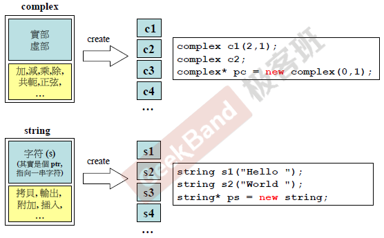

## 基于对象与面向对象的区别

基于对象（Object Based）：面对的是单一class的設計

面向对象（Object Oriented）：面对的是多重classes 的设计，classes 和classes 之间的关系。

显然，要写好面向对象的程序，先基于对象写出单个class是比不可少的。

## C++类的两个经典分类

一个是没有指针的类，比如将要写的complex类，只有实部和虚部，另一个就是带有指针的类，比如将要写的另一个类string，数据内部只有一个指针，采用动态分配内存，该指针就指向动态分配的内存。

## 头文件防卫式声明

从这开始介绍complex类，首先是防卫式声明，与c语言一样，防止头文件重复包含，上面是经典写法，还有一个`# pragma once`的写法，两者的区别可以参考这篇[博客](<https://blog.csdn.net/winscar/article/details/7016146>)。

## 头文件的布局

首先是防卫式声明，然后是前置声明（声明要构建的类，这个例子中还有友元函数），类声明中主要写出这个类的成员数据以及成员函数，类定义部分则是将类声明中的成员函数进行实现。

## 类的声明

这里的complex类是侯捷老师从c++标准库中截取的一段代码，足够说明问题，complex类主体分为public和private两部分，public放置的是类的初始化，以及复数实虚部访问和运算操作等等。private中主要防止类的数据，目的就是要隐藏数据，只暴露public中的接口，private中有double类型的实虚部，以及一个友元函数，这个友元函数实现的是复数的相加，将用于public中的+=操作符重载中，在public中，有四个函数，第一个是构造函数，目的是初始化复数，实虚部默认值为0，当传入实虚部时，后面的列表初始化会对private中的数据进行初始化，非常推荐使用列表初始化数据。第二个是重载复数的+=操作符，应该系统内部没有定义复数运算操作符，所以需要自己重载定义。第三个和第四个是分别访问复数的实部和虚部，可以看到在第一个大括号前面有一个const，**这个原因将在后面讲述**（加粗提醒自己），只要不改变成员数据的函数，都需要加上const，这是规范写法。

## 类模板简介

由于我们不光是想创建double类型的复数，还想创建int类型的复数，愚蠢的想法是在实现一遍int类的complex，这时候类模板派出用场了，模板是一个很大的话题，侯捷老师有一个专门课程讲模板，笔记也会更新到那里。模板可以只写一份模板代码，需要生成不同类型的class，编译器会自动生成，具体做法是在类定义最上方加入template <typename T>，然后讲所有的double都换成T即可，在初始化的时候，在类的后面使用尖括号，尖括号中放入你想要生成的类型即可。

## 内联（inline）函数

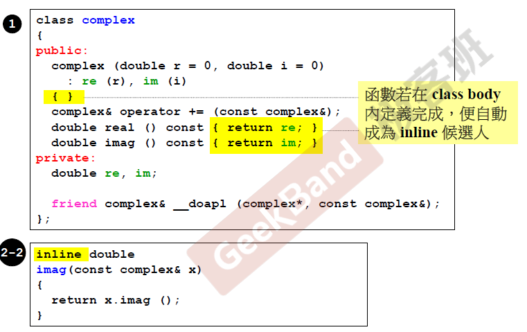

内联函数和普通函数的区别在于：当编译器处理调用内联函数的语句时，不会将该语句编译成函数调用的指令，而是直接将整个函数体的代码插人调用语句处，就像整个函数体在调用处被重写了一遍一样。是一种空间换取时间的做法，当函数的行数只有几行的时候，应该将函数设置为内联，提高程序整体的运行效率。更加详细的说明可以参考这篇[文章](<http://c.biancheng.net/view/199.html>). （补充：在类的内部实现的函数编译器会自动变为inline，好像现在新的编译器可以自动对函数进行inline，无需加inline，即使加了编译器也未必真的会把函数变为inline，看编译器的判断)

## 访问级别

这里上面说过，private内部的函数和成员变量是不能被对象调用的，可以通过public提供的接口对数据进行访问。

## 函数重载

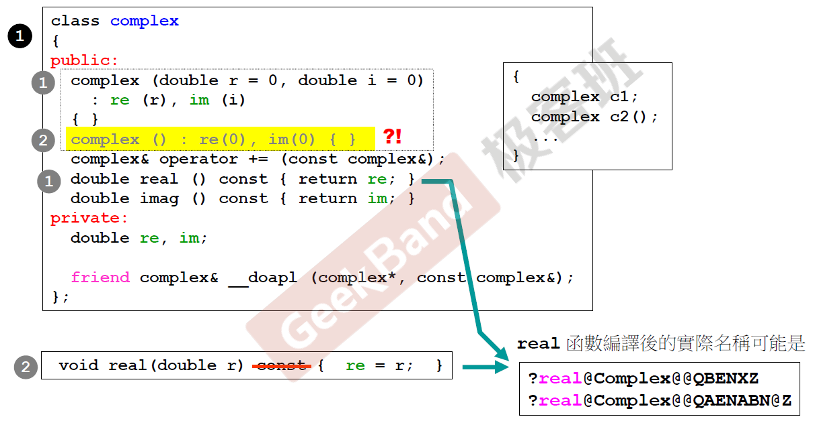

c++中允许“函数名”相同，但函数参数需要不同（参数后面修饰函数的const也算是参数的一部分），这样可以满足不同类型参数的应用。上述中就有不同的real，不必担心它们名字相同而反正调用混乱，相同函数名和不同参数，编译器编译后的实际名称会不一样，实际调用名并不一样，所以在开始的函数名打了引号。另外，写相同函数名还是要注意一下，比如上面有两个构造函数，当使用complex c1初始化对象时，编译器不知道调用哪一个构造函数，因为两个构造函数都可以不用参数，这就发生冲突了，第二个构造函数是不需要的。

## 构造函数的位置

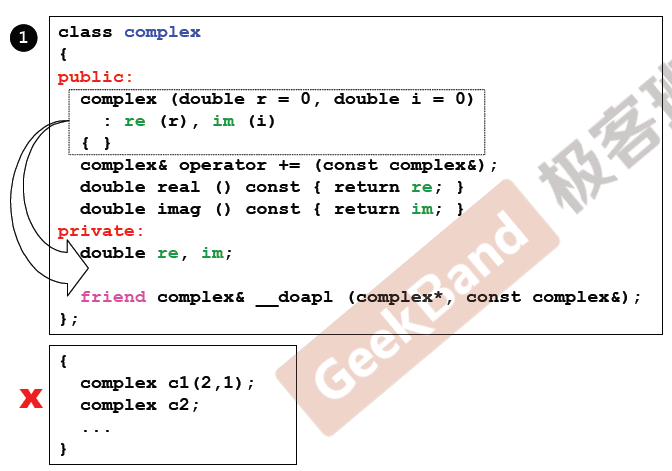

一般情况下，构造函数都放在public里面，不然外界无法初始化对象，不过也有例外的，有一种单例设计模式，就将构造函数放入在private里面，通过public静态（static）函数进行生成对象，这个类只能创建一份对象，所以叫单例设计模式

## 参数传递

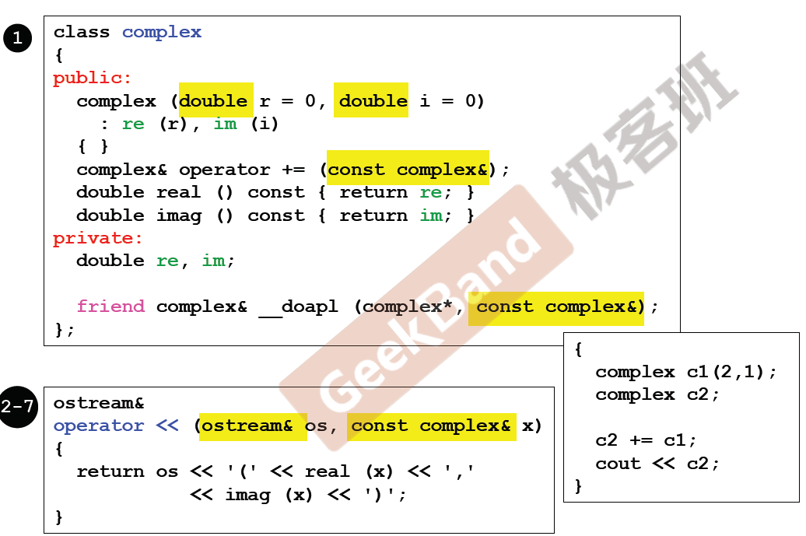

参数传递分为两种：pass-by-value和pass-by-reference

**一条非常考验你是否受过良好c++训练就是看你是不是用pass-by-reference**。传值会分配局部变量，然后将传入的值拷贝到变量中，这既要花费时间又要花费内存，传引用就是传指针，4个字节，要快好多，如果担心传入的值被改变，在引用前加const，如果函数试图改变，就会报错。

## 返回值传递

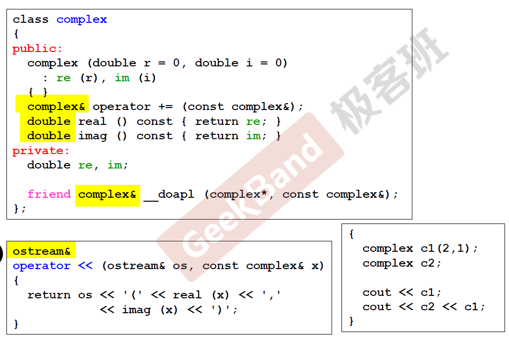

与参数传递一样，返回值传引用速度也会很快，但有一点是不能传引用的，如果你想返回的是函数内的局部变量，传引用后，函数所分配的内存清空，引用所指的局部变量也清空了，空指针出现了，这就很危险了。（引用本质上就是指针，主要用在参数传递和返回值传递）

## 友元

友元函数是类的朋友，被设定为友元的函数可以访问朋友的私有成员，这个函数（do assignment plus）用来做复数加法的具体实现。第一个参数是复数的指针，这个会在this一节中进行说明。

另外还有一种情况很有意思，如下图所示，复数c2可以访问c1的数据，这个也是可以的，这可能让人感到奇怪，侯捷老师说了原因：相同类的各個对象互為友元。所以可以c2可以访问c1的数据。

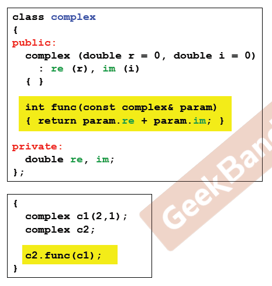

## 操作符重载（一），this， cout

上面介绍的`__doapl`函数将在操作符重载中进行调用，可以看到第一个参数是this，对于成员函数来说，都有一个隐藏参数，那就是this，**this是一个指针，指向调用这个函数的对象**，而**操作符重载一定是作用在左边的对象**，所以+=的操作符作用在c2上，所以this指向的是c2这个对象，然后在`__doapl`函数中修改this指向c2的值。

另外，还记得上面说过`<<`运算符重载嘛，它作用的不是复数，而是ostream，这是处于使用者习惯的考量，作用复数的话将形成`complex<<cout`的用法，这样很不习惯，用于ostream就跟平常使用的cout一样，另外，下面这个函数返回的引用，那么就可以构成`cout << c2 << c1`这种连串打印的程序（与平常的习惯，`cout << c2`返回的依然是cout的引用，又可以调用`<<`重载函数，如果不是引用，则会报错，侯捷老师讲到这，真感觉标准库的设计真是厉害。另外，每次向os传入值打印时，os的状态会发生改变，所以os不能加const。上面复数的加法由于返回的是引用，也可以构成`c3 += c2 += c1`这样的程序。

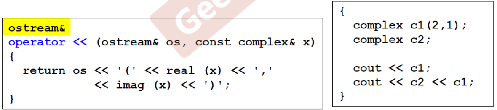

## 操作符重载（二）非成员函数，无this，临时对象

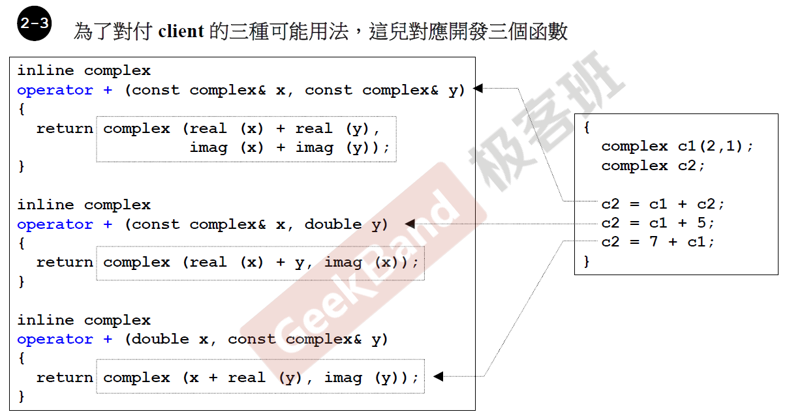

由于使用者可能有多种复数的加法，所以要设计不同的函数满足使用者的要求，由于带有其他类型的参数，所以没有放入complex类中，放在外面定义，这里的有一个非常有趣的使用，返回的直接是complex（ xx， xx），没见过呢，这个语法是创建一个**临时对象**，这个临时对象在下一行就消亡了，不过没关系，我们已经把临时对象的值传到返回值了。由于是临时对象，所以返回值不能是引用，必须是值。

好了，complex的相关细节写得差不多，有些没写，上面都提到了，还有些操作符重载，与加法类似，不重复写了。具体参考`complex.h`，下面进入string类的实现。

## Big Three ---string class begin

与complex一样，string类的整个实现分布如上图，右边的是测试的程序。

下面来看看string的缩小版实现：

由于字符串不像复数那样固定大小，而是可大可小，所以在实现string类的时候，私有数据是一个指针，指向动态分配的char数组，这样就可以实现类似动态字符串大小。这个小章节叫big three，这里的big three分别是，拷贝构造（String(const String & str) )，拷贝赋值（String& operator=(const String& str))，以及析构函数（ ~String()) 。为什么要有big three，这个马上就会介绍。

## 构造函数与析构函数

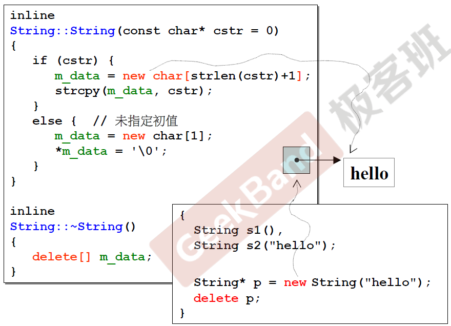

在构造函数中，如果没有传入字符串，则string申请动态分配一个char[1], 指向的就是`'\0'`，也就是空字符，如果传入的是`“hello”`, 则动态分配`“hello”`的长度再加一(一代表结束标识符'\0')，都是用string内部的指针指向动态分布的内存的头部。为什么多了一个析构函数呢？在complex类为啥没有呢？**这是因为complex中没有进行动态分配内存，在复数死亡后，它所占用的内存全部释放，完全ok，但string类动态分配了内存，这份内存在对象的外部，不释放内存的话，在对象死亡后依然存在，这就造成内存泄漏，所以需要构建一个析构函数，在对象死亡释放动态分配的内存。**动态分配使用的时new命令，返回的是分配出来的内存的首地址，释放动态分配内存使用delete命令，如果分配的是数组对象，则需要在delete后加上[]，如果是单个，直接delete指向的指针即可。上面就有两种情况的实例。

## 拷贝构造与拷贝赋值

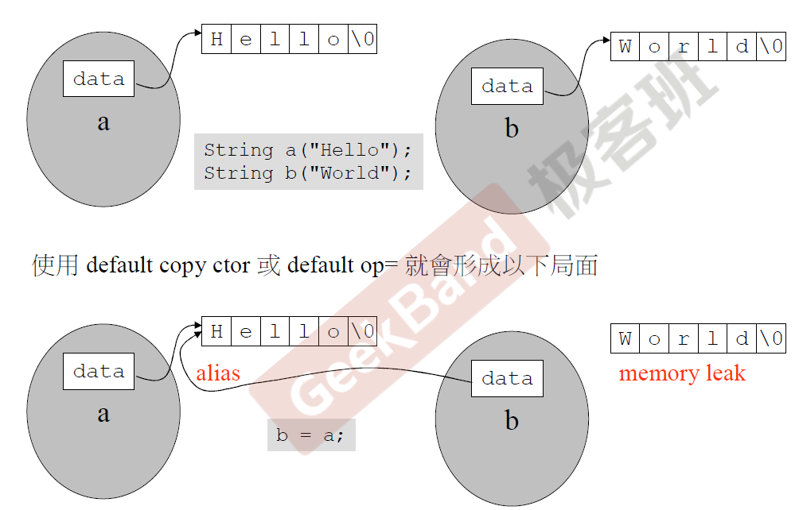

complex类其实内部存在c++语言自身提供的拷贝构造和拷贝赋值，不需要自己写，因为没有指针的类的数据赋值无非就是值传递，没有变化。但string类不一样，上面的图是很好的例子，因为使用的是动态分配内存，对象a和对象b都指向外面的一块内存，如果直接使用默认的拷贝构造或者拷贝赋值（例如将b = a），则是将b的指针指向a所指的区域，也就是a的动态分配内存的首地址，原来b所指向的内存就悬空了，于是发生内存泄漏，而且两个指针指向同一块内存，也是一个危险行为。所以带有指针的类是不能使用默认的拷贝构造和拷贝赋值的，需要自己写。下面看看怎么写的。

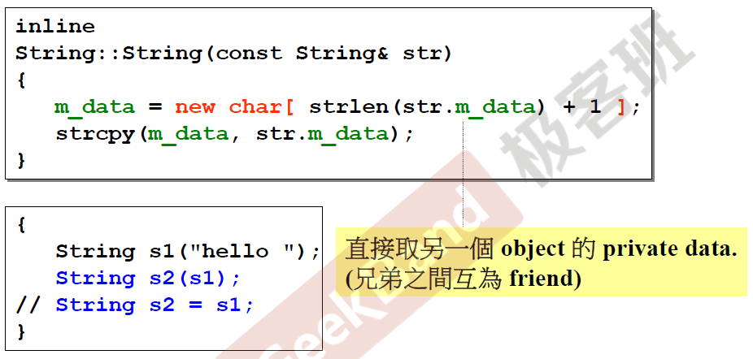

首先是拷贝构造，由于是构造函数一种，跟之前的构造函数一样，需要分配一块内存，大小为要拷贝的string的长度+1，然后使用C语言自带的strcpy进行逐个赋值。

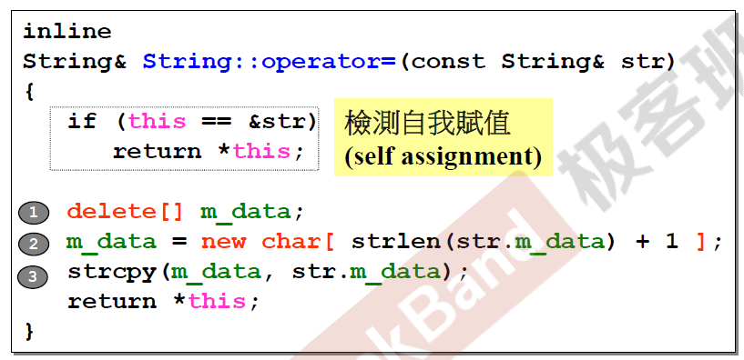

上面这个拷贝赋值，首先检查是不是自我赋值，只要有这种情况发生，就要考虑，自我赋值则直接返回this所指的对象就可以了，如果不是自我赋值，则删除分配的内存，重新分配内存，长度为传入字符串的长度+1，同理使用strcpy函数进行逐个赋值。

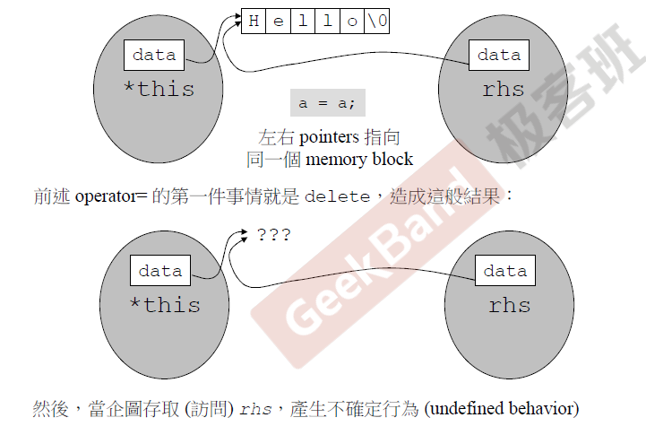

自我赋值的检查很重要，没有自我检查，就会发生上面的情况，一运行程序的第一句话，内存就释放了，指针就又悬空了，不确定行为产生。

string剩余一点放到这里面，打印直接调用get_c_str成员函数就可以，返回指针，os会遍历它所指向的内存，打印出字符串，遇到`'\0'`终止。

## 生命期——堆，栈，静态，全局

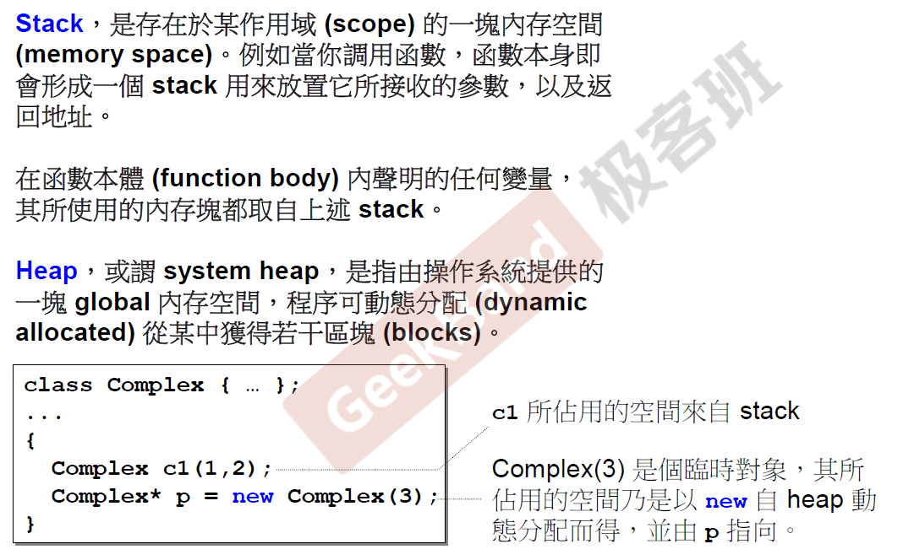

c1 便是所谓stack object，其生命在作用域(scope) 结束之际结束。这种作用域內的object，又称为auto object，因为它会被「自动」清理。p所指的便是heap object，其生命在它被deleted 之际结束，所以要在指针生命结束之前对堆内存进行释放。

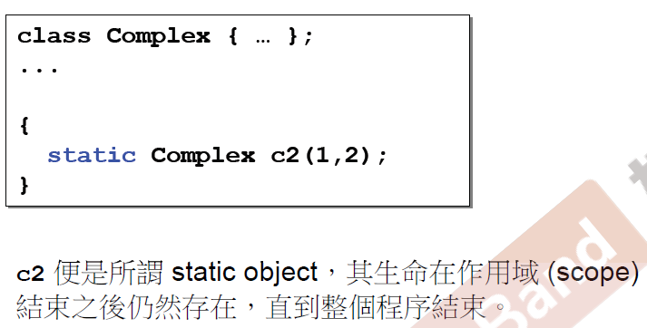

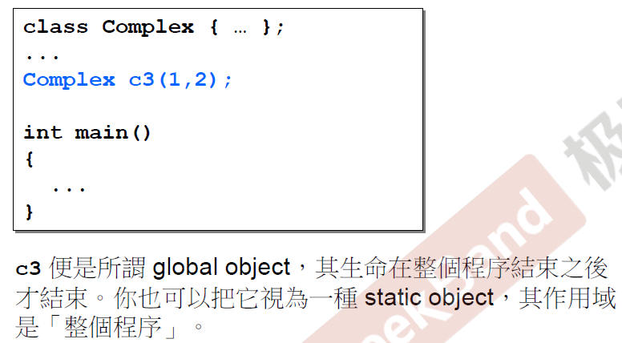

上面的c2和c3分别是静态对象和全局对象，作用域为整个程序。以下是它们四个的内存分布，更具体的细节可以参考这篇[文章](<https://www.cnblogs.com/ChenZhongzhou/p/5685537.html>)。

## 重探new与delete

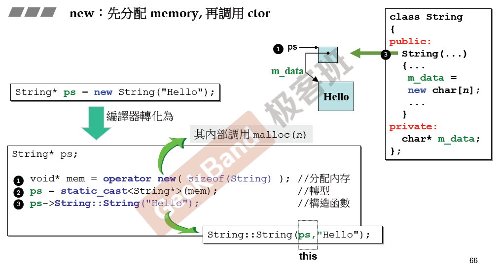

可以到使用new命令动态分配内存，主要有以下三步，首先分配要构建对象的内存，返回的是一个空指针，然后对空指针进行转型，转成要生成对象类型初始化给指针，然后指针调用构造函数初始化对象。

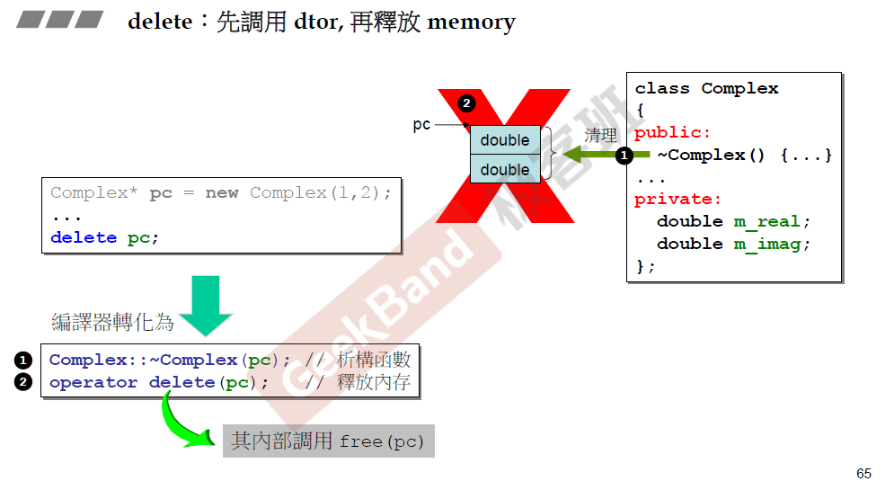

可以看到delete操作可以分为两步，首先调用析构函数释放对象，然后通过操作符delete（内部调用free函数）释放分配的内存。

## 探究动态分配过程的内存块

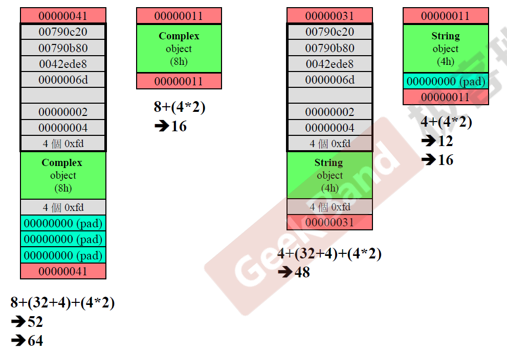

上图中就是vc创建complex类以及string类的内存块图，左边两个是complex类，长的那个是调试（debug）模式下的内存块分布，短的那个是执行（release）模式下的内存块分布，复数有两个double，所以内存占用8个字节，vc调试模式下，调试的信息部分内存占用是上面灰色块的32个字节以及下面灰色块的4个字节，红色的代表内存块的头和尾（叫cookie），占用八个字节，合在一起是52个字节，vc会以16个字节对齐，所以会填充12字节，对应的是pad的部分，另外，为了凸显这是分配出去的内存，所以在头尾部分，用最后一位为1代表该内存分配出去了，为0就是收回来了。执行模式下没有调试信息。string类类似分析。

## 动态分配array需要注意的问题

上面是动态分配内存，生成complex类的数组以及string类的数组的内存块图，与上面类似，不过这里多了一个长度的字节，都为3，标记对象的个数。

上面说明的是，如果分配的是动态对象数组，就一定要在delete后面加上[]符号，不然就无法完全释放动态分配的内存。**array new一定要搭配array delete**。

part1到此结束。