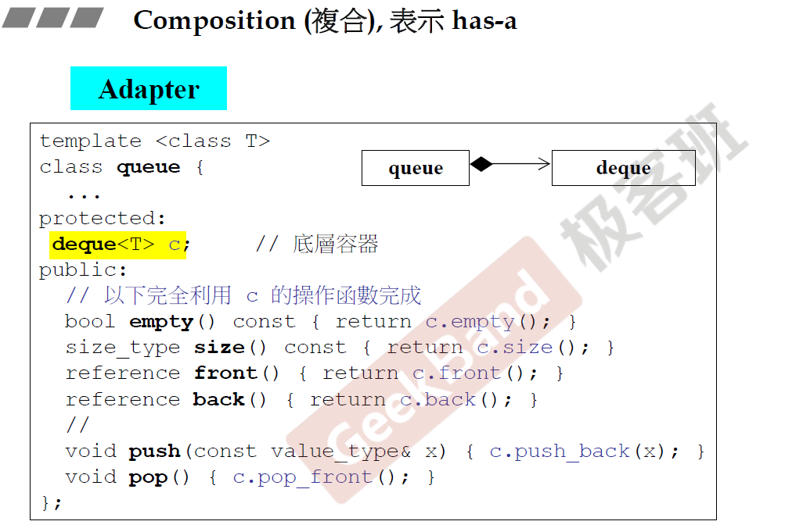
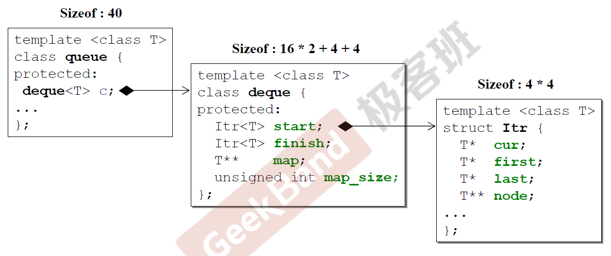
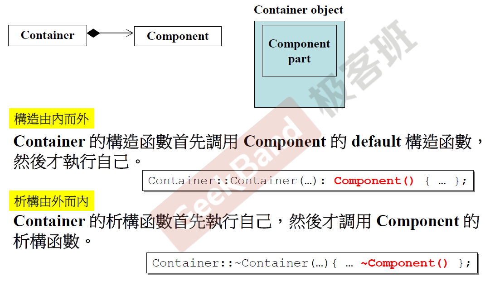
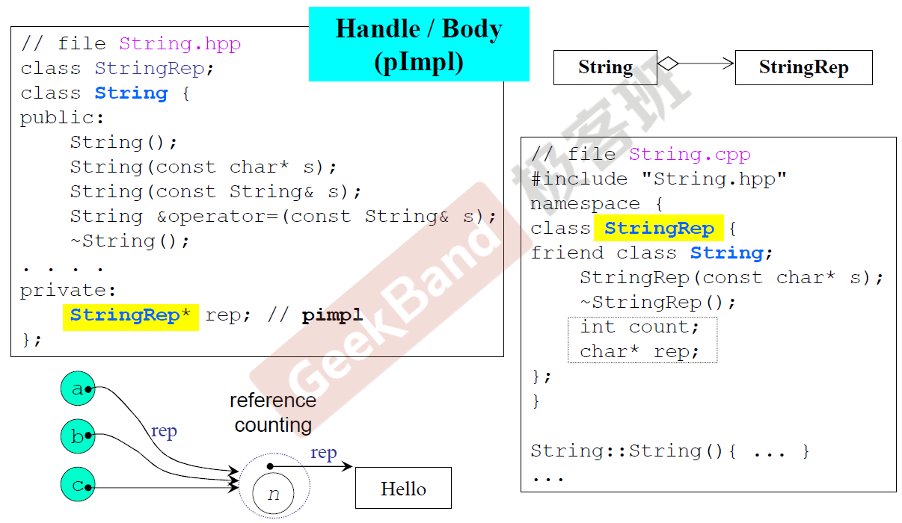
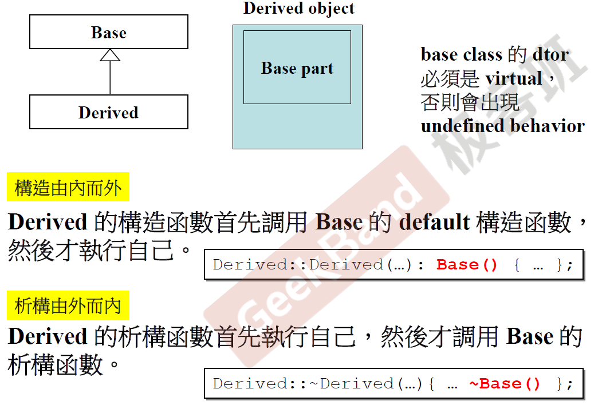
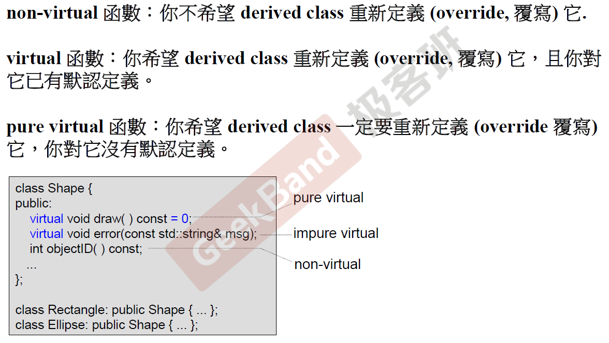
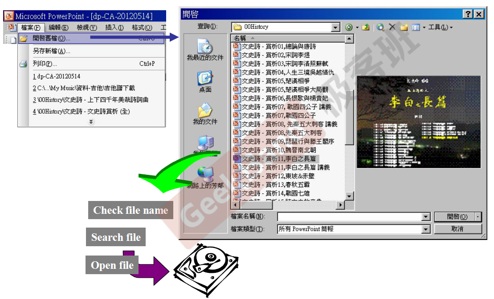
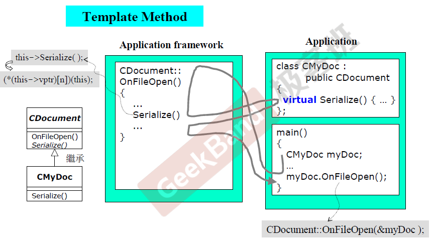

# C++面向对象程序设计_Part2

part1讲述了基于对象，part2则是在基于对象的基础上，建立类与类之间的联系，即面向对象编程以及面向对象设计。

主要讲述以下三点：

- Inheritance （继承）
- Composition（复合）
- Delegation （委托）

另外，我把补充内容中的对象模型放入到Part2，我觉得放入这里更加合适。

[TOC]

## Composition（复合）

Composition（复合）就是has a， 上面的事例就是队列（queue）类中有一个双端队列（deque）类，队列中的成员函数通过双端队列的操作函数完成，这是类与类之间的第一个关系。（黑色菱形代表内部拥有）

deque中可能拥有很多方法，但queue中只通过deque提供了非常少的方法，这是一个设计模式Adapter，将一个拥有许多功能的类改造一下，得到另一个类。

## 内存视角下的composition（复合）

可以看到有两个复合关系，最后queue的内存是40.

## composition（复合）关系下的构造与析构

由于Container类是拥有Component类，所以在构造方面，先调用Component类的默认构造函数，然后再调用Container的构造函数，由内而外的构造，里面做好了，再做外面。析构则相反，先对Container进行析构，然后再对Component进行析构，过程是由外而内，将外面的去掉，才能看到里面去掉里面，符合常识。

## Delegation (委託) —— Composition by reference

如果一个类（string）中拥有一个指针（StringRep*），该指针指向的是另一个类（StringRep），这种关系是Delegation（委托），更好的说法就是Composition by reference（学术界不说by pointer），两种类的生命周期不一样，与复合两种类会同时初始化不同，委托当需要用的时候再进行初始化。上图中的实例是一种非常有名的设计，叫handle/body，指针指向的类负责具体实现，可以看到有一个//pimpl，意思是pointer to implement，而拥有那个指针的类只提供外界接口，就是基于委托这种方式，Handle（string）是提供给外界的接口，body（StringRep）就是实现部分，为什么这么有名，这是因为String类设计好了就不需修改了，只需要修改实现的那一个类，具有很好的弹性，另外，还有可以进行共享机制（减小内存），下图的a，b，c共享一个StringRep，这种方式叫做reference counting，当需要修改其中一个时，需要把内容copy出来一份进行修改，另外两个依然指向原StringRep。（白色菱形代表指针指向）

## Inheritance （继承）

继承的语法就是在类名后加上：public（还可以是protected，private）你想要继承的类，如果想继承多个类，用逗号隔开就可以了。什么时候用继承，确定一个关键点，子类is a 父类（例如，狗is a动物）。上述的List_nodes是继承了List_node_base所有的数据，另外还有自己的数据。

## Inheritance （继承）关系下的构造与析构

继承的类（derived object）的一部分是基类（base part），对于要被继承的基类，它的析构函数必须是virtual，不然会出现问题，这个问题将在后面说。继承的构造函数会首先调用基类的构造函数，然后调用自己的构造函数（由内而外）。析构则相反，先析构自己，然后再调用基类的析构函数。

## Inheritance （继承）with virtual functions（虚函数）

子类继承了父类的两样东西，一种是父类的数据，一种是父类函数的调用权。对于一个类而言，它的子类都可以访问所以的public方法，而子类要不要重新定义父类的函数呢？这时候就需要虚函数了，当public里面的函数不是虚函数时，则希望子类不重新定义该函数。当函数是虚函数时（在返回类型前加入关键字virtual），则希望子类重新定义它，并且父类已经有了默认定义。当函数是纯虚函数时（在结束符；前面加上=0），则希望子类一定要重新定义它，父类没有默认定义（但可以有默认定义）。该事例是定义了一个基类shape，然后矩形Rectangle和椭圆Ellipse对shape进行继承，基类的objectID是无需继承的，可以提前定好，在父类调用即可，而error函数，父类有默认的错误信息，如果子类有更精细的错误信息，父类允许子类可以重新定义的，打印出子类调用时的错误，而draw函数则必须重新定义，父类没有定义（draw shape没有意义），子类不同，所画出的形状自然不同。

## Inheritance （继承）with virtual ——经典实例

对于在powerpoint打开ppt文件而言，有以下几步，先点打开命令的菜单栏，然后出现文件界面，选择我们要打开的文件名，然后程序会检查文件名是否符合规范，符合规范则在磁盘上搜索文件，搜索到了打开文件即可。而遇到注意的是，所以打开文件的过程都是这样，只有最后打开文件可能会不同（可能会打开不同格式的文件），于是有团队就将除文件打开函数以外的函数进行打包，子类直接继承，只要子类重新定义父类打开文件的函数即可。如下图所示：

团队开发了CDocument类，定义Serialize函数需要重新定义，在OnFileOpen函数中的省略号即为打包好的过程。用CDocument类的人只需重新定义Serialize函数即可，则在main函数中，先创建一个CMyDoc实例myDoc，调用myDoc.OnFileOpen函数，子类没有定义这个函数，实则调用的是父类的函数，即CDocument::OnFileOpen(&myDoc), 进入父类函数中，运行打包好的过程，当运行到Serialize函数时，发现子类重新定义了它，则调用子类重新定义的Serialize函数，最后再返回到CDocument::OnFileOpen，继续下面的过程。再也不用写一般的步骤了，完美！这是一种非常有名的设计模式Template method（不是说C++ template），提供了一种应用框架，它将重复一样的操作写好，不确定的步骤留给实际应用设计者重新实现。十年前最有名的产品MFC就是这样一种应用框架。