# C++面向对象程序设计_Part2

​                                     作者：方阳，笔记地址：https://github.com/FangYang970206/Cpp-Notes

part1讲述了基于对象，part2则是在基于对象的基础上，建立类与类之间的联系，即面向对象编程以及面向对象设计。

主要讲述以下三点：

- Inheritance （继承）
- Composition（复合）
- Delegation （委托）

另外，我把补充内容中的对象模型放入到Part2，我觉得放入这里更加合适。

[TOC]

## Composition（复合）


Composition（复合）就是has a， 上面的事例就是队列（queue）类中有一个双端队列（deque）类，队列中的成员函数通过双端队列的操作函数完成，这是类与类之间的第一个关系。（黑色菱形代表内部拥有）

deque中可能拥有很多方法，但queue中只通过deque提供了非常少的方法，这是一个设计模式Adapter，将一个拥有许多功能的类改造一下，得到另一个类。

## 内存视角下的composition（复合）


可以看到有两个复合关系，最后queue的内存是40.

## composition（复合）关系下的构造与析构


由于Container类是拥有Component类，所以在构造方面，先调用Component类的默认构造函数，然后再调用Container的构造函数，由内而外的构造，里面做好了，再做外面。析构则相反，先对Container进行析构，然后再对Component进行析构，过程是由外而内，将外面的去掉，才能看到里面去掉里面，符合常识。

## Delegation (委託) —— Composition by reference


如果一个类（string）中拥有一个指针（StringRep*），该指针指向的是另一个类（StringRep），这种关系是Delegation（委托），更好的说法就是Composition by reference（学术界不说by pointer），两种类的生命周期不一样，与复合两种类会同时初始化不同，委托当需要用的时候再进行初始化。上图中的实例是一种非常有名的设计，叫handle/body，指针指向的类负责具体实现，可以看到有一个//pimpl，意思是pointer to implement，而拥有那个指针的类只提供外界接口，就是基于委托这种方式，Handle（string）是提供给外界的接口，body（StringRep）就是实现部分，为什么这么有名，这是因为String类设计好了就不需修改了，只需要修改实现的那一个类，具有很好的弹性，另外，还有可以进行共享机制（减小内存），下图的a，b，c共享一个StringRep，这种方式叫做reference counting，当需要修改其中一个时，需要把内容copy出来一份进行修改，另外两个依然指向原StringRep。（白色菱形代表指针指向）

## Inheritance （继承）


继承的语法就是在类名后加上：public（还可以是protected，private）你想要继承的类，如果想继承多个类，用逗号隔开就可以了。什么时候用继承，确定一个关键点，子类is a 父类（例如，狗is a动物）。上述的List_nodes是继承了List_node_base所有的数据，另外还有自己的数据。

## Inheritance （继承）关系下的构造与析构


继承的类（derived object）的一部分是基类（base part），对于要被继承的基类，它的析构函数必须是virtual，不然会出现问题，这个问题将在后面说。继承的构造函数会首先调用基类的构造函数，然后调用自己的构造函数（由内而外）。析构则相反，先析构自己，然后再调用基类的析构函数。

## Inheritance （继承）with virtual functions（虚函数）


子类继承了父类的两样东西，一种是父类的数据，一种是父类函数的调用权。对于一个类而言，它的子类都可以访问所以的public方法，而子类要不要重新定义父类的函数呢？这时候就需要虚函数了，当public里面的函数不是虚函数时，则希望子类不重新定义该函数。当函数是虚函数时（在返回类型前加入关键字virtual），则希望子类重新定义它，并且父类已经有了默认定义。当函数是纯虚函数时（在结束符；前面加上=0），则希望子类一定要重新定义它，父类没有默认定义（但可以有默认定义）。该事例是定义了一个基类shape，然后矩形Rectangle和椭圆Ellipse对shape进行继承，基类的objectID是无需继承的，可以提前定好，在父类调用即可，而error函数，父类有默认的错误信息，如果子类有更精细的错误信息，父类允许子类可以重新定义的，打印出子类调用时的错误，而draw函数则必须重新定义，父类没有定义（draw shape没有意义），子类不同，所画出的形状自然不同。

## Inheritance （继承）with virtual ——经典实例


对于在powerpoint打开ppt文件而言，有以下几步，先点打开命令的菜单栏，然后出现文件界面，选择我们要打开的文件名，然后程序会检查文件名是否符合规范，符合规范则在磁盘上搜索文件，搜索到了打开文件即可。而遇到注意的是，所以打开文件的过程都是这样，只有最后打开文件可能会不同（可能会打开不同格式的文件），于是有团队就将除文件打开函数以外的函数进行打包，子类直接继承，只要子类重新定义父类打开文件的函数即可。如下图所示：


团队开发了CDocument类，定义Serialize函数需要重新定义，在OnFileOpen函数中的省略号即为打包好的过程。用CDocument类的人只需重新定义Serialize函数即可，则在main函数中，先创建一个CMyDoc实例myDoc，调用myDoc.OnFileOpen函数，子类没有定义这个函数，实则调用的是父类的函数，即CDocument::OnFileOpen(&myDoc), 进入父类函数中，运行打包好的过程，当运行到Serialize函数时，发现子类重新定义了它，则调用子类重新定义的Serialize函数，最后再返回到CDocument::OnFileOpen，继续下面的过程。再也不用写一般的步骤了，完美！这是一种非常有名的设计模式Template method（不是说C++ template），提供了一种应用框架，它将重复一样的操作写好，不确定的步骤留给实际应用设计者重新实现。十年前最有名的产品MFC就是这样一种应用框架。

深层次的理解，谁调用函数，this就是谁，当调用Serialize函数是，编译器是通过this->Serialize()调用，于是就调用到了this重新定义的Serialize函数。

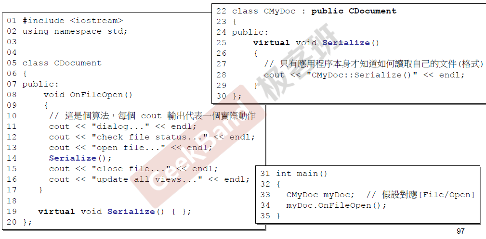

上图就是CDocument和CMyDoc的实例，用cout来模拟步骤，呼应上面两张图片。

## Inheritance + Composition关系下的构造与析构

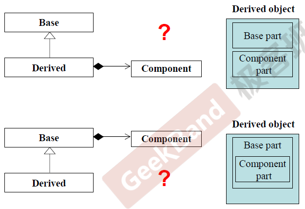

当同时存在继承和复合，类是如何进行构造和析构呢？这一节要讨论的问题：

1. 子类有父类的成分还有包含着另一个类；
2. 子类继承父类，父类拥有另外一个类。

情况2就很明显了，构造依然是自内而外，析构是由外而内。

对于情况1，这是侯捷老师留的作业，自己写代码判断，我写了一个：

```c++
#include <iostream>

using namespace std;

namespace fy1{
    class Base;
    class Derived;
    class Component;

    class Base{
    public:
        Base() {cout << "Base Ctor" << endl;}
        virtual ~Base() {cout << "Base Dtor" << endl;}
    };

    class Component{
    public:
        Component() {cout << "Component Ctor" << endl;};
        ~Component() {cout << "Component Dtor" << endl;};
    };

    class Derived : Base{
    public:
        Derived() {cout << "Derived Ctor" << endl;}
        ~Derived() {cout << "Derived Dtor" << endl;}
    protected:
        Component c;
    };

    void fy1_test(){
        Derived d;
    }
}

int main() {
    cout << "Ctor and Dtor test:" << endl;
    fy1::fy1_test();
    return 0;
}
```

运行结果为：

```bash
Ctor and Dtor test:
Base Ctor
Component Ctor
Derived Ctor
Derived Dtor
Component Dtor
Base Dtor
```

可以看到先初始化父类（Base），然后再初始化Component类，再初始化自己，析构与构造相反。

下图也给出了结论。

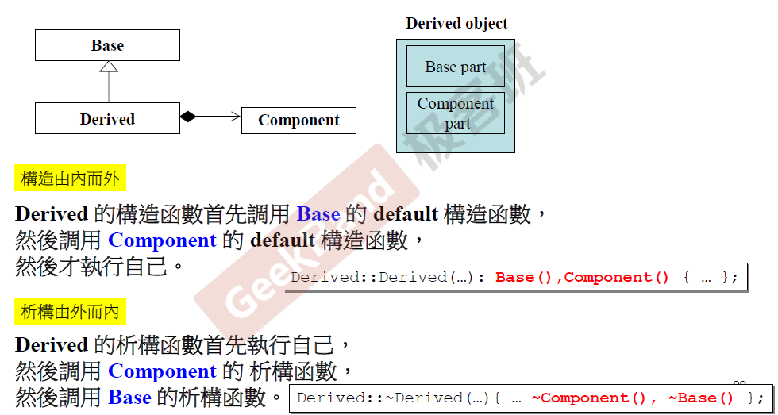

至此，面向对象的概念说完了，下面进入实例环节。

## Delegation (委托) + Inheritance (继承) （一）

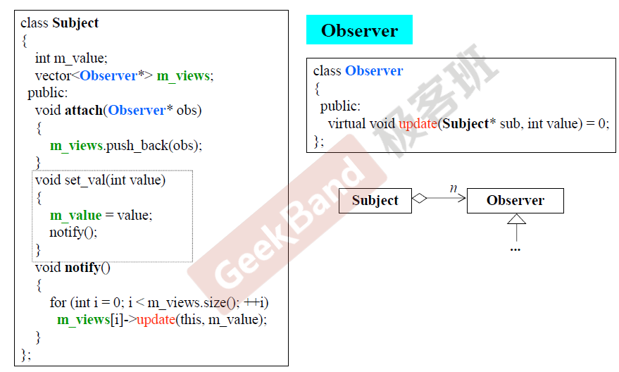

上述代码解决的是下图所示的问题，对同一份文件使用四个不同窗口去查看，或者右下角所示的，同一个数据，三种不同的viewer查看。数据只有一份，表现多种形式，数据变化，表现形式也会发生变化，要表现这样的特性，这就对表现文件的class和存储数据的class之间关系要有要求，上图就是下图的一种解法，23种设计模式之一。Subject类是存储数据的类，不过类中有delegation，使用了一个vector类用来存放Observer类的指针，这样Observer类以及它的所有子类都可以导入这个vector中，Observer类相当于表现形式类的父类，可以有多种表现形式，这些都是子类。update则是子类需要重新定义的方法，不同表现形式可以有不同的更新方法。对于Subject类来说，当我们想创建新的窗口（新的observer类）去查看它的时候，需要对将新的Observer类进行注册，函数attach就是实现这样的功能，可以将新的observer子类的指针加到vector中，注销的函数没有写出来，另外，当数据发生变化时，使用set_val函数，需要使用一个函数去更新所有的observer子类，这就是notify函数干的事，遍历vector每一个observer指针，调用指针指向的update方法，对表现形式进行更新。Delegation + Inheritance真的感觉好强大呀。

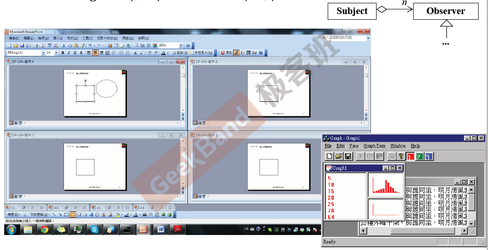

下图是一个更详细的Observer解法构建

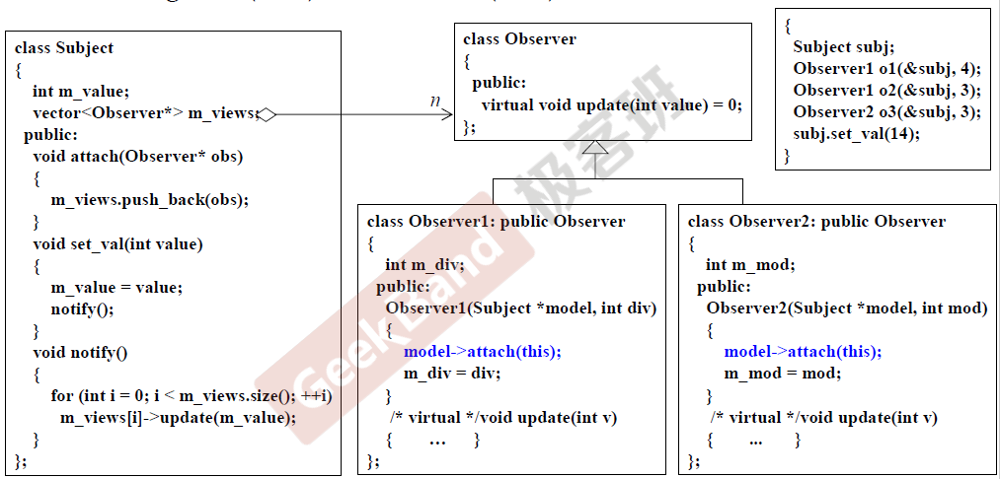

## Delegation (委托) + Inheritance (继承) （二）

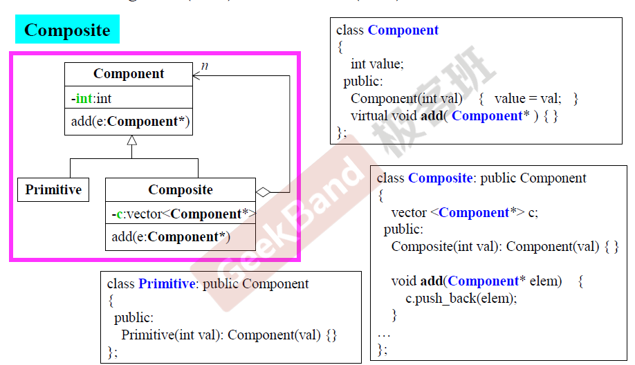

第二个实例，构建一个文件系统。可以把Primitive类当作文件类，而Composite类当作目录类，与日常使用的文件系统一样，目录里面可以包含目录，也可以包含文件，所以目录里面存放的不止是目录本身还可以是文件，但是需要放入到同一个容器中，想法是使用指针，但文件和目录是不太一样的，所以解决方案是将文件和目录共同继承Component类，然后Composite类中的容器存放的是Component的指针，这样就可以既存放文件又可以存放目录了，这是一种经典的解决方案，也是23种设计模式之一，Composite。另外，Component类中还有一个虚函数add，这是给目录进行继承的，因为目录可以新建目录和文件，这里不能设置为纯虚函数，因为文件不能继承这个函数，文件是不能在进行添加的。

## Prototype

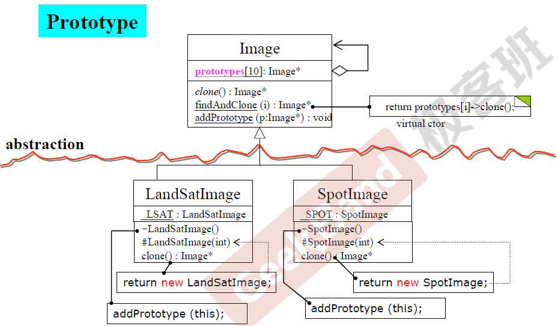

这又是23种设计模式之一的Prototype，Prototype要解决的是要设计一个类，这个类是为未来的子类所设计的，他可以访问和操作未来的子类，这就很有意思了，都不知道未来的子类是啥，要去访问这个子类，这是怎么去做呢？原来在子类内部会申明一个关于子类的静态变量，就是上图中的<u>LSAT</u> : LandSatImage，另外这个子类会定义一个私有的构造方法（前面有一个负号，可以通过定义静态变量调用私有的构造方法），构造方法里面会调用父类的addPrototype函数，将静态变量的指针传到父类，父类就把传入的指针（通过父类的指针形式）加入到自己的容器当中，这样父类就知道子类的类型，就可以操作子类了，上述操作是这样的，父类有一个findAndClone函数，根据输入参数i选择父类容器中的子类进行clone，返回子类的指针，而clone父类定义的是一个纯虚函数，子类必须重新定义，上图中子类重新定义的是返回新建一个子类，返回它的指针，不过这个新建是调用的另外一个构造函数（有一个＃号，代表protect），使用private里面的构造函数是不行的，它是为父类打通桥梁的，为了与private里面的构造函数区分开，形参有一个int类型，这个int类型不会进行使用。

下面的图片是相关代码，解释上面的文字已经说的很清楚了。

父类Image

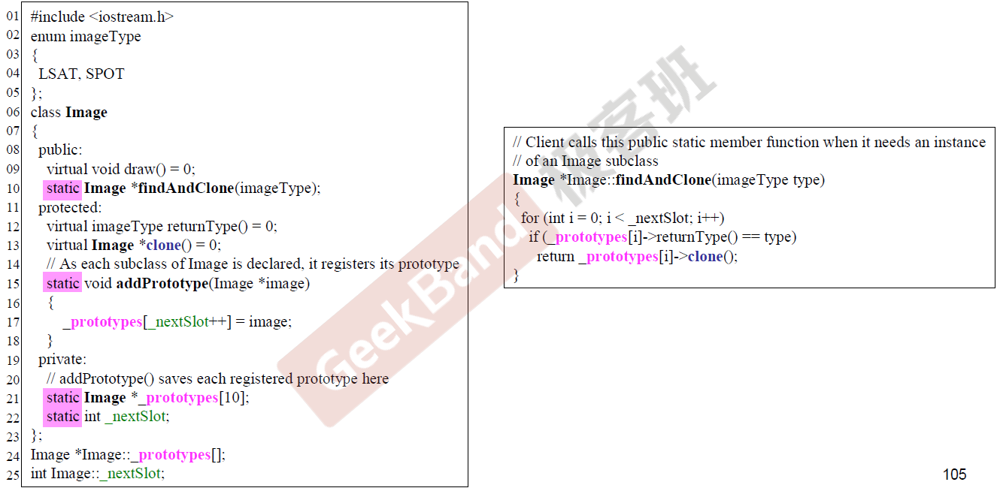

两个子类代码：

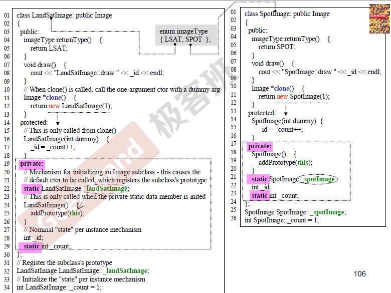

主函数：

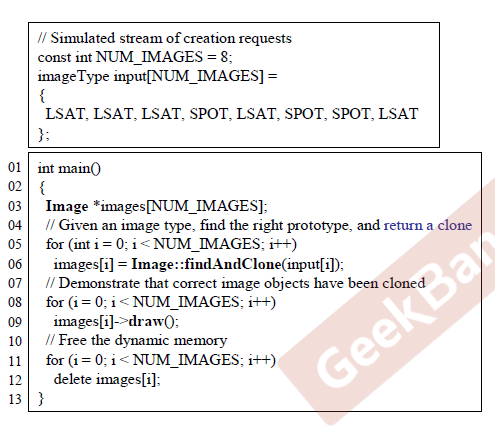

Prototype例子来自于《Design Patterns Explained Simply》这本书，经典致敬！

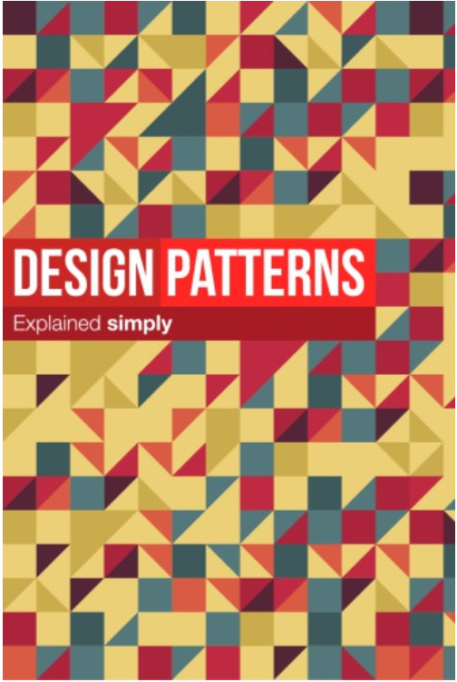

面向对象的例子讲完了，下面介绍更加深层次的内容，理解面向对象更底层的东西。

## 对象模型

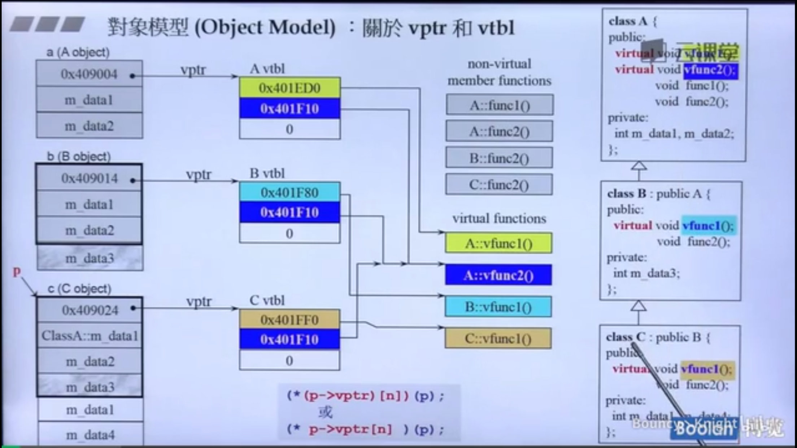

这张图所蕴含的信息量很大，现在一步步来看，首先最右边有三个类，A，B，C，A是爷爷，B是父亲，C是孙子，向上继承的关系，首先我们从内存的角度来看类的布局，对于有虚函数（不管有多少个虚函数）的类来说，它在内存中不仅有自己定义的数据，还会多出一个指针，这个指针学名叫做虚指针（vptr），虚指针会指向一个虚表（vtbl），虚表里面定义的是各个虚函数所在的地址。A类内存中第一个就是虚指针，指向虚表，虚标里面有两个指针指向A的两个虚函数，下面两个是A类的数据，B类的前三个是继承了A类的数据以及虚指针，不同的是B类重新定义了vfunc1函数，这将更新虚表，会将原来指向A::vfunc1函数的指针改为指向B::vfunc1函数的指针，如图就是将黄色的0x401ED0变为了浅蓝的0x401F80，C类继承B类的数据和虚指针，另外还有自己的数据，同时又重载了vfunc1，所以对应虚表中的vfunc1指针也要发生变化。在调用的时候，根据类中虚指针定义的虚表所指向的函数进行调用虚函数，这就是继承的根本原理，虚函数则是面向对象最强大的武器。非虚函数就是普通的函数，不过前面加上了类作用域。

静态绑定与动态绑定：当new一个C类时，得到一个指针p（上图所示），当通过p调用vfunc1的时候，实际上是最下面中间语句进行调用的（其中n为编译器给虚函数在虚表中的索引），这是函数的调用方式与c很不一样，在c的时代，当编译器看到函数调用，编译器会直接调用call XXX(XXX代表地址)，地址是静态的，不会发生变化，这种方式叫做静态绑定，而C++通过类指针找到虚指针，根据虚指针找到虚表，从虚表中取出虚函数地址进行调用，这是一种动态的调用，不同类的指针所调用的虚函数是不一样的，这种方式叫做动态绑定，也叫虚机制。

下图就是一个实例，展示了这种动态绑定的强大威力。

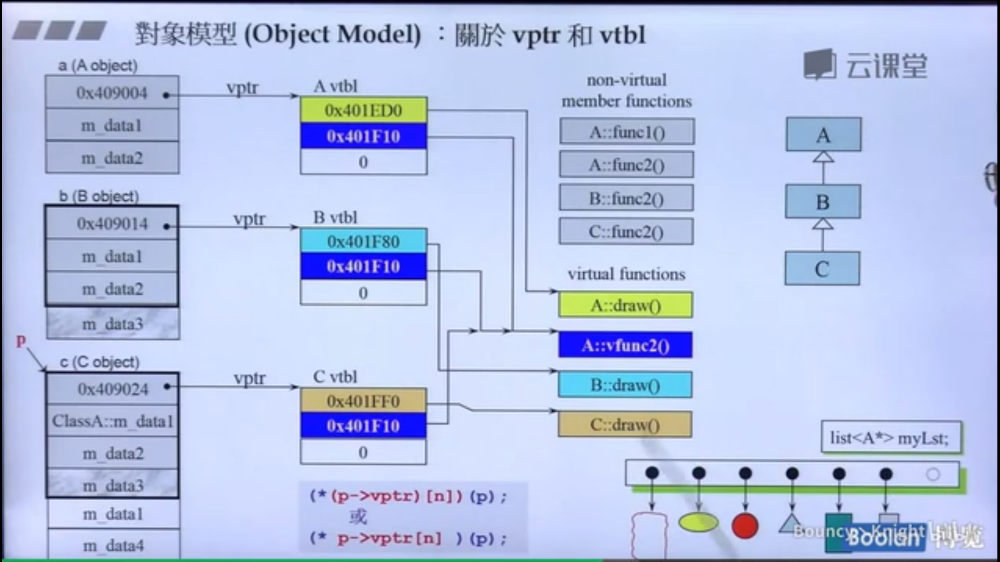

我要设计一个powerpoint，要画出各种不同的形状，我们可以用一个List，承载A类的指针（放指针是因为容器只能放内存大小一致的东西，不同的形状内存不一致），这样它的所有子类都可以放入List中了，因为都是A类，放入List后，循环遍历直接调用各自形状的draw函数就可以完成要求，这里走的依然是动态绑定，这是很好的，为了更加突出动态绑定的好处，这里要写出c语言中是如何做的，c语言只有静态绑定，上述过程需要条件判断当前的指针是指向哪一个类，各种形状要使用多重判断，另外，当需要添加新的形状类时，又要修改条件判断代码，这是很不好的，不符合直观理解，应该像C++的虚函数一样，指针指向什么形状，就应该调用那种类型的draw。由此可见，C++动态绑定很棒，很强大。C++支持动态绑定和静态绑定，符合下面三个条件，C++采用动态绑定，条件如下：

- 必须使用指针调用函数
- 该指针必须是向上转型 (List中定义的类型是A的指针，但可以存储C的指针，通过继承向上转型)
- 调用的函数必须是虚函数

这里还有一个概念——多态，List申明的时候，是通过pointer-to-A进行申明的，但实际是List可以存储各种不同的形状，都属于A，确是不同形态，所以叫多态。

所以，所谓的多态，虚函数，动态绑定，虚指针以及虚表，所有的故事都是同一件事情，真的了然于胸啊!:smile:

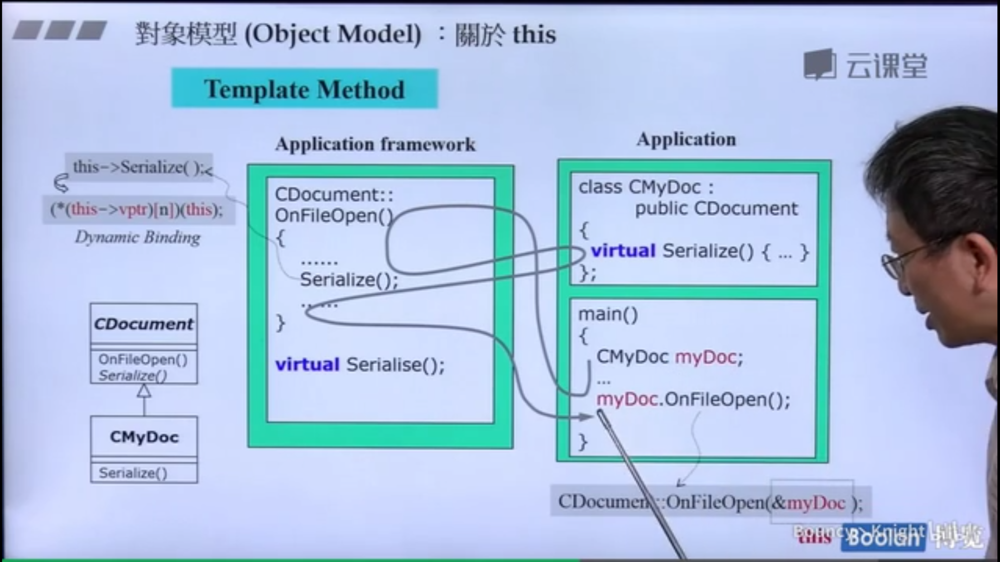

可以再来看看之前讲的Template method，这就是动态绑定的一个应用，子类CMyDoc调用父类的OnFileOpen函数，调用的时候会将子类的地址传入到父类的函数中，也就是this pointer（成员函数都是一个默认参数，代表的就是this pointer，谁调用成员函数，谁的地址就是this pointer），在OnFileOpen中，所有的调用前面都会加上一个this pointer，而对于Serialize函数来说，它是符合上述我们说的三个条件的，首先调用者是this，是指针，然后指向的是子类，向上转型，调用的Serialize函数是虚函数，所以会使用动态绑定，调用CMyDoc的Serialize函数。这是很好的！

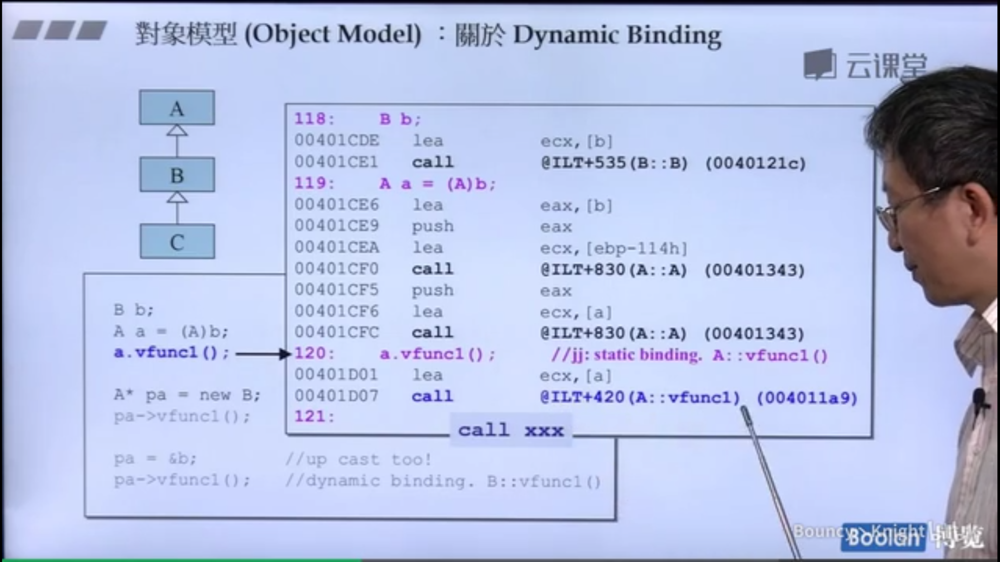

现在从汇编代码的角度来看函数调用，初始化B类，讲B类强制转型为A类，得到a，调用a.vfunc1()函数，这里是静态绑定，因为是通过类调用函数，不是指针调用，汇编代码也说明了这个问题，使用的是call xxx形式编译函数。

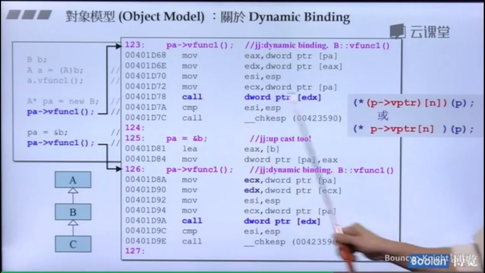

而新创建了一个指针B，给的类型是指针A的类型，通过然后调用vfunc1函数，符合三个条件，是动态绑定，汇编代码的形式也不一样了，汇编表示看不懂，不过call一行连同上面几行最后的表示在c语言中的描述确实是动态绑定的描述。另外，将b的地址赋给pa，重新调用vfunc1，一样是动态绑定，与new B是一样的。

```c++
#include <iostream>

using namespace std;


namespace fy2{
    class A{
    public:
        virtual void vfunc1() {cout << "A::vfunc1()" << endl;}
    private:
        int data1;
    };

    class B : public A{
    public:
        virtual void vfunc1() {cout << "B::vfunc1()" << endl;}
    private:
        int data2;
    };

    void fy2_test(){
        B b;
        A a = (A) b;
        a.vfunc1();

        A* pa = new B;
        pa->vfunc1();

        pa = &b;
        pa->vfunc1();
    }
}

int main() {
    cout << "object model test:" << endl;
    fy2::fy2_test();
    return 0;
}
```

输出结果：

```bash
object model test:
A::vfunc1()
B::vfunc1()
B::vfunc1()
```

面向对象的笔记到此结束，深深感受到了C++面向对象程序的power，fighting！