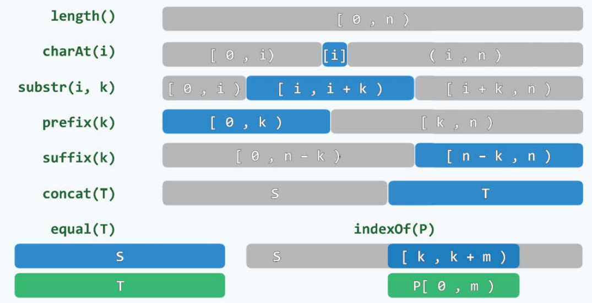
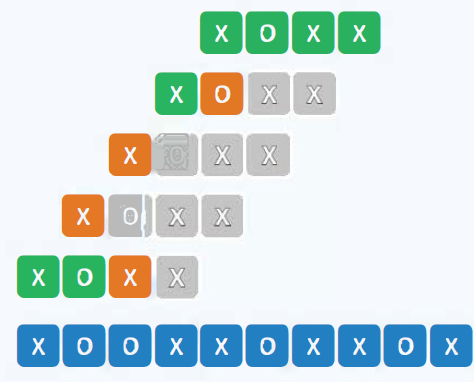
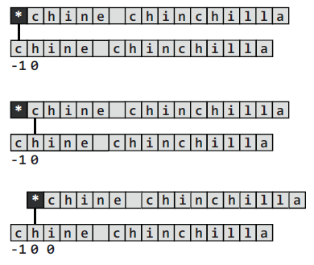
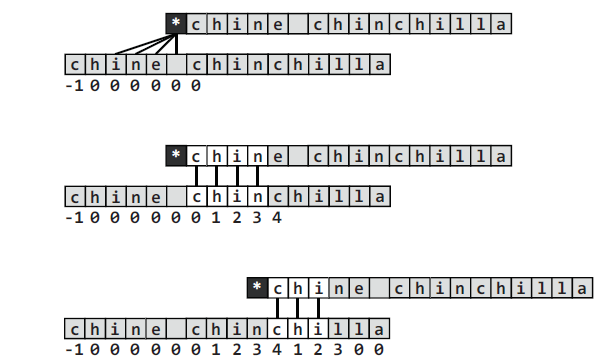

# 串

[TOC]

串通常是由字母表组成，也就是ASCII字符集组成的有限字符串序列。这里讨论有关串的算法。将以C++语言实现, 在C++中，串指的是string这种数据结构。

## 基本术语

介绍一下串的基本术语。

- length() : 对应串的长度，对应string的size或者length成员函数。
- charAt() : 取串中第i个字符，对应string的[]操作符。
- substr(i, k) : 从串中第i个字符开始，依次由k个字符组成的字符串，与string的substr函数接口一致。
- prefix(k) : 取前缀k个字符，string中使用substr函数即可达成目标。
- suffix(k) : 取后缀k个字符，string中使用substr函数即可达成目标。
- concat(T) : 将串T加到串S上去，对应string里面的+=运算符。
- equal(T) : 两个字符串是否相等，对应string的==运算符。
- indexOf(p): 在S中寻找串P，返回第一次出现串p的位置，对应string的find函数。



## 模式匹配

串匹配问题是解决许多应用（文本编辑器，数据库检索，C++模板匹配，模式识别等等）的重要技术。

这个问题有两个输入，第一个是文本（Text），第二个是模式（Pattern），目的是要在文本中寻找模式。通常而言文本要远大于模式。

T :  now is the time for all good **people** to come  （长度为**n**)

P ：**people**   (长度为**m**)

串匹配问题可分为四种类型：

- detection : P是否出现？
- location : P首次出现在哪里？
- counting : P出现了多少次？
- enumeration : 各出现在哪里？

显然，解决location是最重要的，如果监测到了，就表明出现了（detection），出现多少次，只要将未比较的字符串根据同样的方法求得下一次首次出现的位置，直到整个文本结束，出现在哪里只要记录位置做标记即可。

下面开始介绍串匹配算法。

### 暴力匹配

思想是自左而右，以字符为单位，依次移动模式串，直到某个位置发生匹配。



这个算法最好的情况是第一次就比对成功，最好情况的上边界则是每次比对时，第一个字符都不匹配，这样就移动一格，最好情况的复杂度就等于$\Omega(n)$,  n为文本的长度。最坏的情况是每次比较模式最后一个字符的时候才发现不匹配，这样就会导致最坏情况，时间复杂度为$\mathcal{O}(n \cdot m)$.

C++实现版本1：

```c++
int match(string P, string T) {
	size_t n = T.size(), i = 0;
	size_t m = P.size(), j = 0;
	while (i < n - m + 1 && j < m)     //自左向右逐次比较
		if ( T[i] == P[j]) { i++; j++;}  // 若匹配，则转到下一对字符
		else               { i -= j - 1; j = 0;}  // 否则，T回退，P复位
	return i - j;
}
```

C++实现版本2：

```c++
int match(string P, string T) {
	size_t n = T.size(), i;
	size_t m = P.size(), j;
	for ( i = 0; i < n - m + 1; i++) {  //T[i]与P[0]对齐
		for ( j = 0; j < m; j++)        //逐次匹配
			if ( T[i+j] != P[j]) break; //失配则转到下一位置
		if ( m <= j) break;             //匹配成功，退出，返回i
	}
	return i;
}
```

两个实现版本的返回值都是位置信息，当i等于n - m + 1的时候说明未找到模式，否则就是找到了。

### KMP ：模式记忆

KMP算法的原理是利用Pattern构建一个查询表，根据查询表进行来指导移动位数，并且文本的索引不需要回退。理解这种算法我推荐阮一峰老师的[KMP博客](http://www.ruanyifeng.com/blog/2013/05/Knuth–Morris–Pratt_algorithm.html)，讲得非常清晰，非常直观。

假设你看过这篇博客知道原理了，现在照着代码看一步步运行:

```c++
vector<int> buildNext(string P) { //构造模式串P的next表
    size_t m = P.size(), j = 0;   //“主”串指针
    vector<int> N(m, 0);          //next表
    int t = N[0] = -1;			  //模式串指针（通配符*）
    while ( j  < m - 1 )          //j是不会减小的，j会在循环内变为m-1，此时退出
        if ( 0 > t || P[j] == P[t] ) { //当出现通配符也就是0>t, 当前j自加1，next表对应j为0。
            						   //当不是通配符时，比较是否相等，相等则next表对应j自加1
            j++; t++;
            N[j] = t;
        }
    	else
            t = N[t];  //失配，根据前面得到的next，来看应该从那里开始比较，比如下面的匹配等于4的时候，e不等于c，查表知e所在的位置为0，也就是没有相同的前后缀，所以从0开始继续匹配，如果大于0，说明有共同前后缀，此时应该不从0开始，因为有共同前后缀，可以避开节省时间。
    return N;
}
```

下面有一个事例：






