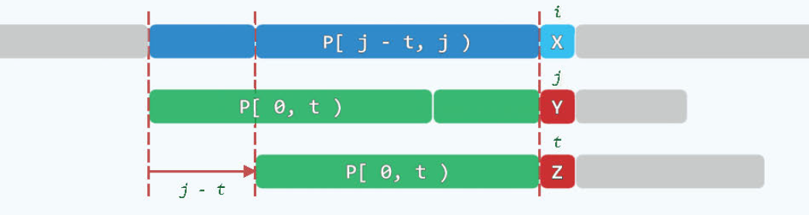
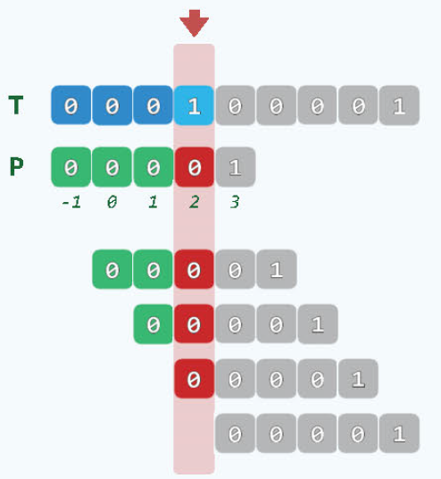
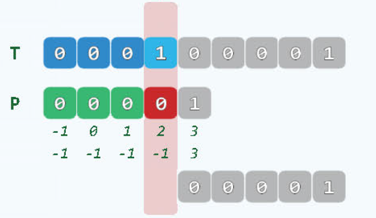
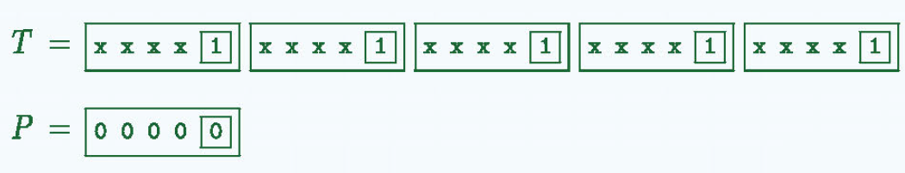
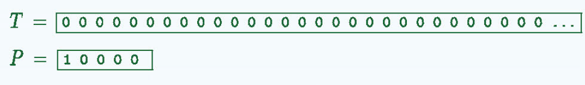
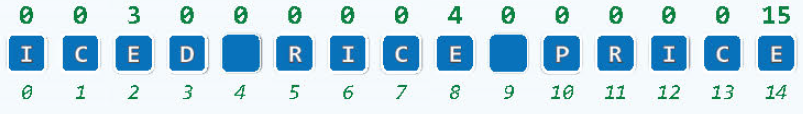
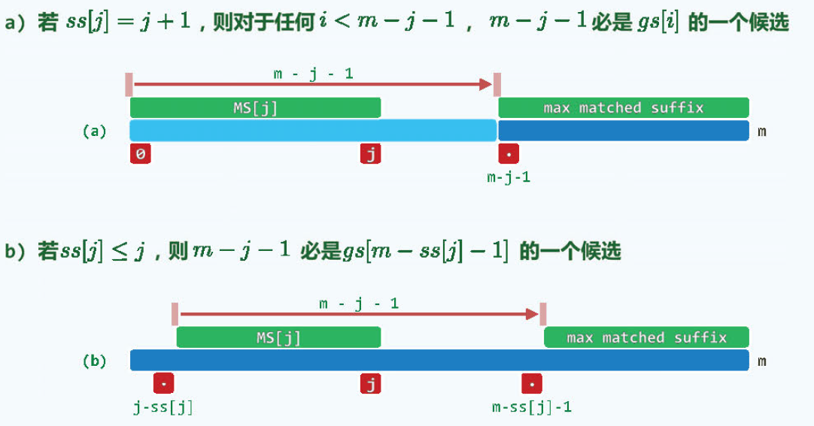
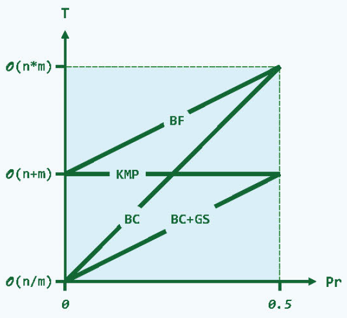

# 串

[TOC]

串通常是由字母表组成，也就是ASCII字符集组成的有限字符串序列。这里讨论有关串的算法。将以C++语言实现, 在C++中，串指的是string这种数据结构。

## 基本术语

介绍一下串的基本术语。

- length() : 对应串的长度，对应string的size或者length成员函数。
- charAt() : 取串中第i个字符，对应string的[]操作符。
- substr(i, k) : 从串中第i个字符开始，依次由k个字符组成的字符串，与string的substr函数接口一致。
- prefix(k) : 取前缀k个字符，string中使用substr函数即可达成目标。
- suffix(k) : 取后缀k个字符，string中使用substr函数即可达成目标。
- concat(T) : 将串T加到串S上去，对应string里面的+=运算符。
- equal(T) : 两个字符串是否相等，对应string的==运算符。
- indexOf(p): 在S中寻找串P，返回第一次出现串p的位置，对应string的find函数。


## 模式匹配

串匹配问题是解决许多应用（文本编辑器，数据库检索，C++模板匹配，模式识别等等）的重要技术。

这个问题有两个输入，第一个是文本（Text），第二个是模式（Pattern），目的是要在文本中寻找模式。通常而言文本要远大于模式。

T :  now is the time for all good **people** to come  （长度为**n**)

P ：**people**   (长度为**m**)

串匹配问题可分为四种类型：

- detection : P是否出现？
- location : P首次出现在哪里？
- counting : P出现了多少次？
- enumeration : 各出现在哪里？

显然，解决location是最重要的，如果监测到了，就表明出现了（detection），出现多少次，只要将未比较的字符串根据同样的方法求得下一次首次出现的位置，直到整个文本结束，出现在哪里只要记录位置做标记即可。

下面开始介绍串匹配算法。

### 暴力匹配

思想是自左而右，以字符为单位，依次移动模式串，直到某个位置发生匹配。


这个算法最好的情况是第一次就比对成功，最好情况的上边界则是每次比对时，第一个字符都不匹配，这样就移动一格，最好情况的复杂度就等于$\Omega(n)$,  n为文本的长度。最坏的情况是每次比较模式最后一个字符的时候才发现不匹配，这样就会导致最坏情况，时间复杂度为$\mathcal{O}(n \cdot m)$.

C++实现版本1：

```c++
int match(string P, string T) {
	size_t n = T.size(), i = 0;
	size_t m = P.size(), j = 0;
	while (i < n - m + 1 && j < m)     //自左向右逐次比较
		if ( T[i] == P[j]) { i++; j++;}  // 若匹配，则转到下一对字符
		else               { i -= j - 1; j = 0;}  // 否则，T回退，P复位
	return i - j;
}
```

C++实现版本2：

```c++
int match(string P, string T) {
	size_t n = T.size(), i;
	size_t m = P.size(), j;
	for ( i = 0; i < n - m + 1; i++) {  //T[i]与P[0]对齐
		for ( j = 0; j < m; j++)        //逐次匹配
			if ( T[i+j] != P[j]) break; //失配则转到下一位置
		if ( m <= j) break;             //匹配成功，退出，返回i
	}
	return i;
}
```

两个实现版本的返回值都是位置信息，当i等于n - m + 1的时候说明未找到模式，否则就是找到了。

### KMP ：模式记忆

暴力匹配算法存在着冗余的问题，当最坏情况时，最后一个字符匹配失败，模式串和文本串的指针都要发生回退。

KMP算法的原理是利用Pattern构建一个查询表，根据查询表进行来指导移动位数，并且文本的索引不需要回退。理解这种算法我推荐阮一峰老师的[KMP博客](http://www.ruanyifeng.com/blog/2013/05/Knuth–Morris–Pratt_algorithm.html)（真心推荐看看），讲得非常清晰，非常直观。

假设你看过阮老师的博客知道原理了，现在来看next表的构建代码:

```c++
vector<int> buildNext(string P) { //构造模式串P的next表
    size_t m = P.size(), j = 0;   //“主”串指针
    vector<int> N(m, 0);          //next表
    int t = N[0] = -1;			  //模式串指针（通配符*）
    while ( j  < m - 1 )          //j是不会减小的，j会在循环内变为m-1，此时退出
        if ( 0 > t || P[j] == P[t] ) { //当出现通配符也就是0>t, 当前j自加1，next表对应j为0。
            						   //当不是通配符时，比较是否相等，相等则next表对应j自加1
            j++; t++;
            N[j] = t;
        }
    	else
            t = N[t];  //失配，根据前面得到的next，来看应该从那里开始比较，比如下面的匹配等于4的时候，e不等于c，查表知e所在的位置为0，也就是没有相同的前后缀，所以从0开始继续匹配，如果大于0，说明有共同前后缀，此时应该不从0开始，因为有共同前后缀，可以避开节省时间。
    return N;
}
```

这里需要注意的一点是，阮一峰老师的博客中当前next表是代表当前j的公共最大前后缀的长度，而这个实现中当前next表是代表j-1的公共最大前后缀的长度。

关于t = N[t]可以见下图，当X不匹配Y的时候，此时我们根据next表，由当前next表的值知，P[0, t)和P[j - t, j)是相同的，此时应该移动j-t，也就是从第t位开始比较，也就是N(t)的长度。有一种特殊情况需要考虑，当N(t)等于0时，此时从0开始比较，如果第0位也不等于当前j，根据性质，t此时就等于-1了，此时就进入0>t的条件，自增j，自增t，当前j没有共同前后缀。这里开始设N[0]等于-1以及t等于-1，有两层作用，第一层是为了首轮比较时，需要隔开一位比较。第二层作用是为了防止后面与第一位不相等时，可以根据-1这个条件进入if条件，防止卡死。很是巧妙。



下面有一个事例：


有了next表的构造方法，接下来就是根据next表进行匹配了。匹配代码如下：

```c++
int match(string P, string T) {
    vector<int> next = buildNext(P);
    size_t n = T.size(), i = 0;
    size_t m = P.size(), j = 0;
    while (j < m && i < n)
        if (0 > j || T[i] == P[j]) { i++; j++;}
    	else j = next[j];
    return i - j;
}
```

理解了next表的构造原理，其实就理解了匹配过程，next构造过程就是模式串的自我匹配。当失配时，如果next表的值大于0，说明有公共的前后缀，那么就不需要从0开始比较，直接从公共前后缀的后一个字符与当前文本的第j个字符开始比较。

### KMP再改进

考虑下面这个情况，明知T[4]不等于P[4]且P[1] = P[2] = P[3] = P[4]，还要比对剩余的P[1], P[2], P[3], 这是没有必要的，这是需要改进next表。



改进只需要把next中的`N[j] = t`换成`N[j] = ( P[++j] != P[++t] ? t : N[t] )`即可。如下所示：



因为相同，所以可以直接跳过他们，更快。

KMP算法的时间复杂度是$O(m + n)$, 空间复杂度是$O(m+n)$. 匹配过程令k = 2i- j，k每次循环至少加1，判断为真则i加1，判断为假，j至少减1，所以k <= 2n - 1; 同理next过程也是如此。

KMP小结：

- 以判断公共前后缀来进行模式串的移动，有公共前后缀，移动到前缀的下一位即可，没有公共前后缀则移动到头部。
- 通过通配符来有效构造next表，表的第一位为-1，当第一位对齐不相等的时候，这时通配符匹配，使文本串（也包括模式串的自我匹配）可以移动起来，不至于卡死。
- 当发生重复串的时候，跳过他们，不进行比较。

### BM算法

对于BM算法的介绍，我同样推荐看阮一峰老师的[BM博客](http://www.ruanyifeng.com/blog/2013/05/boyer-moore_string_search_algorithm.html)（真心推荐看看），讲的十分清楚。同样假设你看过博客知道原理了，就知道BM算法有两个next表，一个是坏字符（bad character）bc表，另一个是好后缀（good suffix）gs表，现在来看看如何构造这两个表。

#### bc表

对于坏字符表，构造起来很简单，它是记录模式串中每种字符最后出现的位置，代码如下：

```c++
vector<int> buildBC(string P){
    vector<int> bc(256, -1);
    for(size_t m = P.size(), j = 0; j < m; j++)
        bc[ P[j] ] = j;
    return bc;
}
```

坏字符移动规则： **后移位数 = 坏字符的位置- 搜索词中的上一次出现位置**

基于BM-DC的算法最好情况就是$O(n/m)$, 最坏情况是$O(m*n)$。

最好情况：



最坏情况：



#### gs表

相比于bc表，gs表就很不好构造了。首先来看看一个概念，最大匹配后缀长度表，通过它来构建ss（suffix size)表，然后通过ss表来构造gs表。

最大匹配后缀长度的意思是在P[0,j)的所有缀中，与P的某一后缀匹配最长者。例如下面的P[0, 3) = ICE, 与末尾的ICE最长匹配，则P[0, 3)的末尾就为最长匹配长度3，RICE同理。（ss表的值就等于最大匹配长度）



ss表末尾的值就是整个模式串的长度，简单的想法是遍历每一个字符向后递减，与后缀开始一一比较(暴力搜索），这样做的复杂度为$O(m^2)$, 很好的做法是下面的代码（从后往前遍历），时间复杂度只有$O(m)$。

```c++
vector<int> buildSS ( string P ) { //构造最大匹配后缀长度表：O(m)
    int m = P.size(); 
    vector<int> ss(m, 0); //Suffix Size表
    ss[m - 1]  =  m; //对最后一个字符而言，与之匹配的最长后缀就是整个P串
// 以下，从倒数第二个字符起自右向左扫描P，依次计算出ss[]其余各项
    for ( int lo = m - 1, hi = m - 1, j = lo - 1; j >= 0; j -- )
        if ( ( lo < j ) && ( ss[m - hi + j - 1] <= j - lo ) ) //情况一：该情况处于最大匹配后缀后的字符，例如，RICE中的R,I,C.
            ss[j] =  ss[m - hi + j - 1]; //直接利用此前已计算出的ss[]
        else { //情况二: 遇到匹配项，依次递减进行匹配
            hi = j; lo = min ( lo, hi );
            while ( ( 0 <= lo ) && ( P[lo] == P[m - hi + lo - 1] ) ) 
                lo--; //逐个对比处于(lo, hi]前端的字符
            ss[j] = hi - lo; // 高位减去递减后的低位，得到最长匹配长度
        }
    return ss;
}
```

知道ss表后，gs表可有ss表推导出，有两种情况：



对应的代码如下：

```c++
vector<int> buildGS ( string P ) { //构造好后缀位移量表：O(m)
   vector<int> ss = buildSS ( P ); //Suffix Size表
   size_t m = P.size(); 
   vector<int> gs(m, m); //Good Suffix shift table
   for ( size_t i = 0, j = m - 1; j < UINT_MAX; j -- ) //逆向逐一扫描各字符P[j]
      if ( j + 1 == ss[j] ) //若P[0, j] = P[m - j - 1, m)，则
         while ( i < m - j - 1 ) //对于P[m - j - 1]左侧的每个字符P[i]而言
            gs[i++] = m - j - 1; //m - j - 1都是gs[i]的一种选择
   for ( size_t j = 0; j < m - 1; j ++ ) //正向扫描P[]各字符，gs[j]不断递减，直至最小
      gs[m - ss[j] - 1] = m - j - 1; //m - j - 1必是其gs[m - ss[j] - 1]值的一种选择
   return gs;
}
```

#### BM_BC+GS

知道了bc表和gs表，接下来就是匹配过程了，与阮老师的博客上说的一致，取两个表的最大值。代码如下：

```c++
int match ( string P, string T ) { //Boyer-Morre算法（完全版，兼顾Bad Character与Good Suffix）
   vector<int> bc = buildBC ( P ), gs = buildGS ( P ); //构造BC表和GS表
   size_t i = 0; //模式串相对于文本串的起始位置（初始时与文本串左对齐）
   while ( T.size() >= i + P.size() ) { //不断右移（距离可能不止一个字符）模式串
      int j = P.size() - 1; //从模式串最末尾的字符开始
      while ( P[j] == T[i + j] ) //自右向左比对
         if ( 0 > --j ) break; 
      if ( 0 > j ) //若极大匹配后缀 == 整个模式串（说明已经完全匹配）
         break; //返回匹配位置
      else //否则，适当地移动模式串
         i += max ( gs[j], j - bc[ T[i + j] ] ); //位移量根据BC表和GS表选择大者
   }
   return i;
}
```

基于BM_BC+GS算法最好情况是$O(n/m)$，最坏情况由于有了gs表，变为了$O(m+n)$.

### 综合性能

各种模式匹配算法的时间复杂度如下所示：

